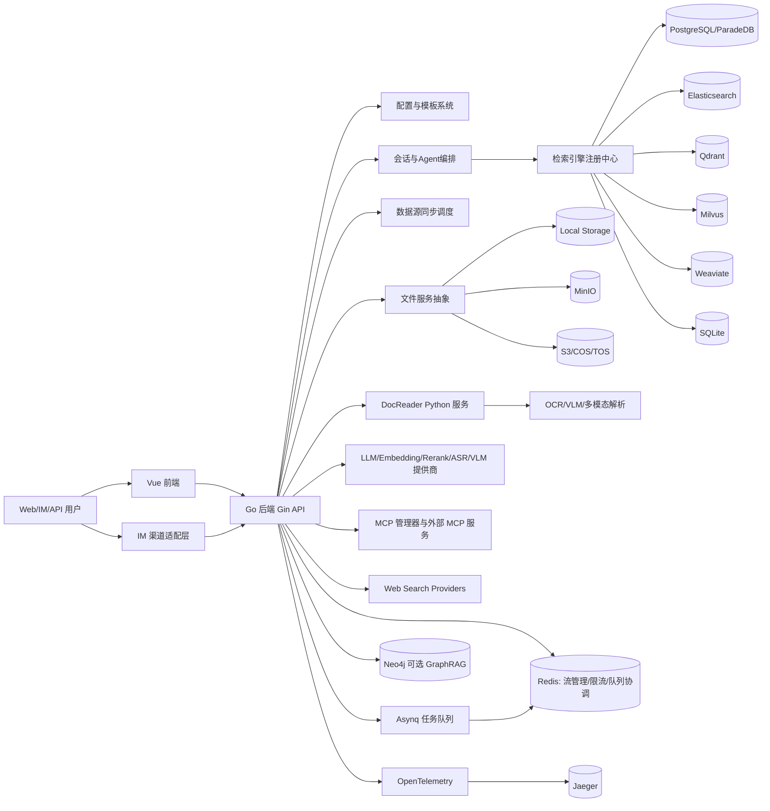

# WeKnora 产品设计与系统架构分析

## 1. 产品定位

### 1.1 WeKnora 是什么，解决什么问题
WeKnora 是一个面向企业级场景的 LLM 驱动知识管理与问答框架，核心目标是把“非结构化文档 + 外部知识源”转化为可检索、可推理、可运营的智能问答能力。

它重点解决以下问题：
- 文档类型复杂、来源分散，难以统一接入与理解
- 通用聊天模型缺乏企业私域知识，回答不稳定、不可追溯
- 单纯 RAG 难以处理多步推理、多工具协同任务
- 多团队/多业务并行使用时，权限、租户隔离、运维复杂

### 1.2 目标用户群体
- 企业内部知识平台团队：需要快速搭建私有化智能问答系统
- AI 应用工程团队：需要可插拔的模型、向量库、存储与工具生态
- 业务系统集成团队：需要通过 API、Web、IM 渠道快速接入问答能力
- 对数据主权敏感的组织：需要本地/私有云部署、可控数据流转

### 1.3 核心价值主张
- 双模式问答：快速问答（RAG）+ 智能推理（ReACT Agent）
- 端到端知识闭环：导入、解析、切分、索引、检索、生成、评估
- 高可扩展架构：模型、向量库、存储、搜索引擎、MCP 工具均可替换
- 企业级能力：多租户、OIDC、IM 集成、审计追踪、异步任务、自动迁移

---

## 2. 核心功能清单

### 2.1 已实现的主要功能模块（截至 v0.3.6）

1. 智能对话引擎
- 快速问答：基于 RAG 的知识库问答
- 智能推理：基于 ReACT Agent 的多轮工具编排与反思
- 对话策略：重写、扩展、重排、阈值控制、Prompt 模板化

2. 知识库管理
- FAQ 与文档两类知识库
- 文件夹导入、URL 导入、在线 Markdown 编辑
- 知识标签、置顶、批量操作、迁移/复制、检索入口

3. 文档理解与处理
- 独立 Python DocReader 服务（gRPC/HTTP）
- 支持 PDF/Word/Markdown/HTML/图片/CSV/Excel/PPT/JSON 等
- 多模态处理：OCR + 图像描述 + 图片持久化
- 父子分块（Parent-Child Chunking）与表格上下文保留

4. 检索与召回
- 混合检索：关键词 + 向量
- 检索后处理：重排、合并、TopK 过滤
- 检索后端可插拔：PostgreSQL、Elasticsearch、Milvus、Qdrant、Weaviate、SQLite

5. 模型与工具生态
- LLM/Embedding/Rerank/ASR/VLM 多模型管理
- 支持 OpenAI、DeepSeek、Qwen、智谱、混元、Gemini、MiniMax、NVIDIA、Ollama 等
- MCP 工具管理与调用（含自动重连、并行工具调用）
- Web Search Provider：DuckDuckGo、Bing、Google、Tavily

6. 多渠道与组织协作
- Web UI、REST API、IM 渠道（企微/飞书/Slack/Telegram/钉钉/Mattermost）
- 共享空间、组织、成员权限、知识库/Agent 共享
- IM 线程会话、引用上下文注入、斜杠命令与队列治理

7. 平台与运维
- Docker Compose 与 Helm 部署
- OpenTelemetry + Jaeger 链路追踪
- 数据库自动迁移与脏状态恢复
- OIDC 登录与 API Key/JWT 认证

### 2.2 规划中的功能（ROADMAP）

1. 轻量化部署与云服务
- 原子化能力接口（Embedding、Rerank、LLM、解析）
- 官方云端服务
- WeKnora Lite 轻量版本

2. 知识理解增强
- 语义分块、章节分块
- 文档结构可视化与图谱展示
- 音视频等更多多模态格式

3. 检索体验增强
- @标签检索范围控制
- 对话中附件上传检索（图片已支持，附件待完善）

4. 模型与生态扩展
- 面向知识库场景的模型训练
- Memory 结合新形态知识库
- Chrome 插件、小程序插件、JS SDK、IDE 插件生态

---

## 3. 系统架构

### 3.1 整体架构图（Mermaid）

### 3.2 服务组成

1. Go 后端（核心控制平面）
- 技术栈：Gin + Dig + GORM + Asynq + OpenTelemetry
- 职责：API、鉴权、多租户、知识库与会话管理、检索编排、Agent 执行、IM 适配、任务调度

2. Vue 前端（交互平面）
- 技术栈：Vue3 + Vite + Pinia + Vue Router + TDesign
- 职责：知识库管理、对话界面、模型配置、组织共享、数据源管理、系统设置

3. Python DocReader（文档理解执行面）
- 技术栈：gRPC、PaddleOCR、MarkItDown、pdfplumber、python-docx、Playwright 等
- 职责：文档解析、切分、多模态提取、OCR、图片描述

4. Python MCP Server（可选工具服务）
- 职责：通过 MCP 协议为 Agent 提供可调用工具能力

5. 基础依赖服务
- PostgreSQL（主业务库 + 检索能力）
- Redis（上下文存储、流式管理、IM 限流与分布式协调、Asynq 后端）
- 向量库（Qdrant/Milvus/Weaviate，可按需启用）
- 对象存储（Local/MinIO/S3/COS/TOS）
- Neo4j（可选 GraphRAG）
- Jaeger（可选链路追踪）

### 3.3 核心交互关系
- 前端/IM/API 请求进入 Go 后端
- 后端根据会话策略触发检索流水线与 Agent 工具调用
- 文档入库流程由后端驱动 DocReader 完成解析切分
- 检索层通过注册中心选择具体后端引擎执行召回
- 任务与异步流程由 Asynq + Redis 驱动，缺失 Redis 时回落同步执行器

---

## 4. 技术选型

### 4.1 后端框架与关键库
- Web 框架：Gin
- 依赖注入：Uber Dig
- ORM：GORM
- 配置：Viper + YAML 模板加载
- 队列：Asynq（Redis）
- 并发池：ants
- 可观测性：OpenTelemetry + Jaeger
- 安全：JWT、OIDC、AES-256-GCM（密钥存储）

### 4.2 前端框架与关键库
- 框架：Vue 3 + Vite + TypeScript
- 状态与路由：Pinia、Vue Router
- UI：TDesign Vue Next
- 文本/渲染：marked、highlight.js、mermaid
- 网络：axios、fetch-event-source

### 4.3 数据库与向量数据库选型
- 主数据库：PostgreSQL（docker 默认 ParadeDB）
- 向量/检索后端支持：
  - PostgreSQL（pgvector）
  - Elasticsearch（v7/v8）
  - Milvus
  - Qdrant
  - Weaviate
  - SQLite（轻量模式）
- 图谱：Neo4j（GraphRAG 可选）

### 4.4 LLM 提供商支持
- OpenAI 兼容及多厂商：OpenAI、DeepSeek、Qwen（阿里云）、智谱、混元、Gemini、MiniMax、NVIDIA、Novita、SiliconFlow、OpenRouter、Ollama 等
- 模型类型覆盖：Chat、Embedding、Rerank、VLM、ASR

### 4.5 存储方案
- 本地存储：Local
- 对象存储：MinIO、AWS S3、腾讯云 COS、火山引擎 TOS
- 文件服务统一抽象，按 provider scheme 动态解析实现

### 4.6 消息队列 / 任务队列
- Asynq + Redis 为主（异步任务、导入处理、后台作业）
- Redis 同时承担会话流控制、IM 分布式协调
- 无 Redis 场景可回落同步执行模式

---

## 5. 代码结构总览

### 5.1 顶层目录结构
- cmd/: 应用入口（server）
- internal/: 核心业务代码
- frontend/: Vue 前端工程
- docreader/: Python 文档解析服务
- mcp-server/: Python MCP 服务
- config/: 全局配置与 Prompt 模板
- docker/ + docker-compose*.yml: 容器化部署
- helm/: Kubernetes 部署 Chart
- migrations/: 数据库迁移脚本

### 5.2 internal/ 分层架构
典型分层路径为：
- handler：HTTP 接口层，入参校验与协议转换
- application/service：业务编排层（会话、知识、Agent、模型、数据源等）
- application/repository：数据访问层（业务库、检索库、图数据库）
- infrastructure：外部系统适配（web_search、docparser 等）
- middleware：认证、语言、日志、错误处理
- router：路由注册与模块化 API 组织
- container：依赖注入装配（BuildContainer）

对应关系可概括为：handler -> service -> repository，外围由 middleware/router/container 贯穿。

### 5.3 前端 src/ 目录结构
- src/api/: 按业务域拆分的接口调用层（agent/auth/chat/datasource/...）
- src/views/: 页面层（chat、knowledge、settings、organization 等）
- src/components/: 通用组件
- src/stores/: Pinia 状态管理
- src/router/: 路由定义
- src/i18n/: 多语言资源
- src/utils/types/composables/hooks/: 工具、类型、组合式逻辑

### 5.4 配置管理方式
- 配置入口：config/config.yaml
- 运行覆盖：环境变量覆盖 YAML 字段（Viper + key replacer）
- Prompt 管理：config/prompt_templates/*.yaml，按 template id 引用
- 启动时回填：将 prompt_id 解析为实际 prompt 文本
- 内置 Agent：builtin_agents.yaml + prompt 引用解析

---

## 6. 部署架构

### 6.1 Docker Compose 部署方案
- 主编排文件：docker-compose.yml
- 开发编排：docker-compose.dev.yml（仅基础设施，App/Frontend 本地运行）
- 默认核心服务：frontend、app、docreader、postgres、redis
- 可选 profile：minio、neo4j、qdrant、milvus、weaviate、jaeger、dex、sandbox/full

### 6.2 Helm Chart 部署方案
- 目录：helm/
- 适配 Kubernetes 1.25+，支持 Ingress、PVC、副本扩缩、资源配额
- 组件开关化：app/frontend/docreader/postgresql/redis + 可选 minio/neo4j/qdrant/jaeger
- 支持 external secret 模式，生产可通过 existingSecret 对接企业密钥体系

### 6.3 必需外部依赖服务
最小可运行集合：
- PostgreSQL
- Redis
- DocReader（若启用文档解析能力）

常见生产增强依赖：
- 对象存储（MinIO/S3/COS/TOS）
- 向量库（Qdrant/Milvus/Weaviate）
- Neo4j（GraphRAG）
- Jaeger（可观测性）
- 外部模型服务（OpenAI 兼容、Ollama 等）

---

## 7. 关键设计决策

### 7.1 为什么选择这种架构分层
- 业务与基础设施解耦：通过 repository/infrastructure 抽象外部依赖
- 装配集中：通过 container 统一依赖注册，避免模块间硬耦合
- 插件式流水线：chat pipeline 事件化组织，便于按阶段扩展
- 多进程协同：Go 控制面 + Python 执行面（文档理解）各司其职

### 7.2 多租户设计
- 核心对象普遍带 tenant 维度
- 路由层统一认证中间件注入租户上下文
- IM 队列、数据源同步、模型配置均支持租户隔离
- 组织共享机制在“可共享”与“租户边界”间平衡协作与安全

### 7.3 可插拔设计（LLM / 向量库 / 存储）
- LLM 可插拔：统一模型抽象，支持多厂商与多模型类型
- 检索可插拔：RetrieveEngineRegistry 动态注册不同检索后端
- 存储可插拔：统一 FileService 接口，按 provider 解析实现
- 工具可插拔：MCP 服务管理 + Web Search Provider 注册机制

这套设计使 WeKnora 能在“本地轻量试用 -> 私有化生产 -> 多云异构集成”之间平滑迁移，降低架构锁定风险。
