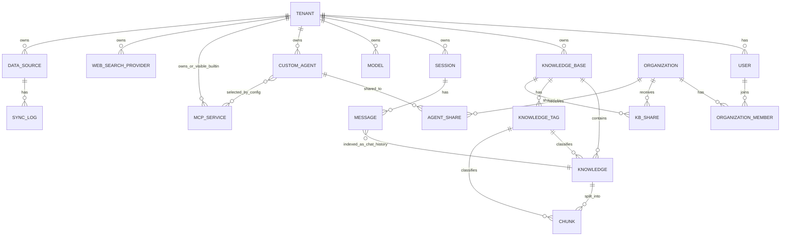

# WeKnora 数据模型与存储层分析

本文基于以下代码与迁移来源整理：

- `internal/types/` 与 `internal/types/interfaces/`
- `internal/application/repository/`
- `migrations/` 与 `internal/database/migration.go`
- 向量检索实现：`internal/application/repository/retriever/`
- 文件存储实现：`internal/application/service/file/`、`internal/container/container.go`

---

## 1. 实体关系模型

关系说明：

- 一对多：Tenant->KnowledgeBase、KnowledgeBase->Knowledge、Knowledge->Chunk、Session->Message。
- 多对多（通过中间表）：
	- Organization<->User 通过 `organization_members`
	- Organization<->KnowledgeBase 通过 `kb_shares`
	- Organization<->CustomAgent 通过 `agent_shares`
- CustomAgent 与 MCPService 是“配置引用关系”（`config.mcp_services`），不是强外键中间表。

---

## 2. 核心实体详解

### 2.1 Tenant

字段与用途（核心）：

- `id`（uint64，主键）：租户标识，默认序列从 10000 起。
- `api_key`：租户 API Key；通过 `BeforeSave/AfterFind` 做 AES-GCM 加解密。
- `retriever_engines`（JSON）：租户级检索引擎组合。
- `storage_quota/storage_used`：存储配额与用量统计。
- `storage_engine_config`（JSONB）：本地/MinIO/COS/TOS/S3 存储参数。
- `chat_history_config`、`retrieval_config`：检索与会话索引配置。

业务规则与约束：

- 全局隔离边界；业务查询普遍带 `tenant_id` 条件。
- `api_key` 持久化加密，读出后透明解密。

关联关系：

- 1:N -> User、KnowledgeBase、Session、Model、CustomAgent、MCPService、WebSearchProvider、DataSource。

### 2.2 Organization

字段与用途（核心）：

- `id`（UUID）：组织 ID。
- `owner_id`：所有者用户。
- `invite_code` + `invite_code_expires_at`：邀请码与过期时间。
- `searchable`、`require_approval`、`member_limit`：开放搜索、审批、人数上限。

业务规则与约束：

- 组织内成员角色：`admin/editor/viewer`。
- 邀请码唯一索引（未删除记录范围）。

关联关系：

- M:N User（`organization_members`）。
- M:N KnowledgeBase（`kb_shares`）。
- M:N CustomAgent（`agent_shares`）。

### 2.3 User

字段与用途（核心）：

- `id`（UUID）、`username`（唯一）、`email`（唯一）。
- `tenant_id`：主租户归属。
- `can_access_all_tenants`：跨租户访问开关（配合系统配置生效）。

业务规则与约束：

- 用户与租户关联；`auth_tokens` 管理 token 生命周期。
- 支持软删除。

关联关系：

- N:1 Tenant。
- M:N Organization（通过 `organization_members`）。

### 2.4 KnowledgeBase

字段与用途（核心）：

- `id`（UUID）、`tenant_id`、`name`、`type`（`document/faq`）。
- `chunking_config`：切块策略（含 parent-child 双层切块）。
- `embedding_model_id`、`summary_model_id`。
- `storage_provider_config`：仅存 provider 选择，凭据在租户层。
- `faq_config`、`question_generation_config`。

业务规则与约束：

- `is_temporary` 用于隐藏临时库（如历史消息索引场景）。
- 文档库与 FAQ 库走不同检索与导入流程。

关联关系：

- N:1 Tenant。
- 1:N Knowledge、KnowledgeTag、Session（会话可引用）。
- M:N Organization（通过 `kb_shares`）。

### 2.5 Knowledge

字段与用途（核心）：

- `id`（UUID）、`tenant_id`、`knowledge_base_id`。
- `type`（如 `manual/faq/url/file`）、`source`、`channel`。
- `parse_status`、`summary_status`、`enable_status`。
- `file_name/file_path/file_hash/file_size/storage_size`。
- `metadata`、`last_faq_import_result`。

业务规则与约束：

- 处理状态驱动异步解析、切块、索引。
- 文件/URL 去重依赖 hash、名称+大小、source。

关联关系：

- N:1 KnowledgeBase。
- 1:N Chunk。
- 可选 N:1 KnowledgeTag。

### 2.6 Chunk

字段与用途（核心）：

- `id`（UUID）+ `seq_id`（对外可读序号）。
- `knowledge_id`、`knowledge_base_id`、`tenant_id`。
- `content`、`chunk_index`、`chunk_type`。
- `status`（default/stored/indexed）、`is_enabled`、`flags`。
- `parent_chunk_id`、`relation_chunks`、`indirect_relation_chunks`。
- `metadata`（FAQ/文档增强信息）、`content_hash`（FAQ 去重）、`image_info`。

业务规则与约束：

- FAQ 场景使用 `content_hash` + metadata 组合进行幂等/差异比对。
- 可通过 flags 管理推荐等多状态位。

关联关系：

- N:1 Knowledge。
- 可选 N:1 KnowledgeTag。
- 自关联：parent-child。

### 2.7 Session

字段与用途（核心）：

- `id`（UUID）、`tenant_id`、`title/description`。
- 历史字段（已注释）保留兼容；当前聚焦会话元信息。

业务规则与约束：

- 会话列表默认按 `updated_at DESC`。
- 支持软删除和批量删除。

关联关系：

- N:1 Tenant。
- 1:N Message。

### 2.8 Message

字段与用途（核心）：

- `id`（UUID）、`session_id`、`request_id`、`role`、`content`。
- `knowledge_references`、`agent_steps`、`mentioned_items`、`images`。
- `knowledge_id`：消息索引到“历史知识”后的关联键。
- `rendered_content`、`channel`、`is_fallback`、`agent_duration_ms`。

业务规则与约束：

- 支持会话内分页、关键词检索、历史消息向量索引绑定。
- 搜索会 join `sessions` 并过滤软删除。

关联关系：

- N:1 Session。
- 可选 N:1 Knowledge（聊天历史 KB 回写）。

### 2.9 Agent（CustomAgent）

字段与用途（核心）：

- `custom_agents` 复合主键：`(id, tenant_id)`。
- `is_builtin`：系统内置代理。
- `config`（JSON）：
	- 模式：`quick-answer`（RAG）或 `smart-reasoning`（ReAct）
	- KB 选择策略、MCP 选择策略、WebSearch、Retrieval 阈值
	- 多模态开关、图片存储 provider、技能选择等

业务规则与约束：

- 内置 Agent 可按租户生成实例（配置可覆盖）。
- 支持组织级共享（`agent_shares`）与“禁用共享代理”列表。

关联关系：

- N:1 Tenant。
- M:N Organization（agent_shares）。
- 配置引用 MCPService IDs。

### 2.10 Model

字段与用途（核心）：

- `id`、`tenant_id`、`type`（Embedding/Rerank/KnowledgeQA/VLLM/ASR）。
- `source`（openai/aliyun/zhipu/volcengine/...）。
- `parameters`（含 APIKey、维度、接口参数）。
- `is_default`、`is_builtin`、`status`。

业务规则与约束：

- `parameters.APIKey` 使用 AES-GCM 加密存储。
- 软删除，支持租户模型与内置模型共存。

关联关系：

- N:1 Tenant。
- 被 KB/Agent/检索流程引用。

### 2.11 Tag（KnowledgeTag）

字段与用途（核心）：

- `id`（UUID）+ `seq_id`（唯一自增）。
- `tenant_id`、`knowledge_base_id`、`name`、`sort_order`。

业务规则与约束：

- 唯一约束：同租户同知识库下 `name` 唯一。

关联关系：

- N:1 KnowledgeBase。
- 1:N Knowledge、Chunk（分类维度）。

### 2.12 FAQ

FAQ 在实现上并非独立表，而是建立在 `knowledges + chunks + chunk.metadata`：

- 标准问、相似问、反例问、答案策略放在 `Chunk.Metadata`。
- `ChunkTypeFAQ` + `content_hash` 用于去重与差异导入。
- 批量导入支持 append/replace、dry-run 校验、失败明细回传。

### 2.13 MCP Service

字段与用途（核心）：

- `id`、`tenant_id`、`name`、`enabled`、`transport_type`。
- `url/headers/auth_config/advanced_config`。
- `stdio_config/env_vars`（stdio 模式）。
- `is_builtin`：内置 MCP 对所有租户可见。

业务规则与约束：

- 传输方式：`sse`、`http-streamable`、`stdio`。
- 内置 MCP 可见但可隐藏敏感信息展示。

关联关系：

- N:1 Tenant（或 builtin 全租户可见）。
- 被 CustomAgent 配置引用。

---

## 3. 多租户模型

### 3.1 Tenant 数据隔离

- 大多数 Repository 在查询层显式带 `tenant_id` 条件（如 `knowledge/session/chunk/message` 等）。
- 共享场景通过明确的中间表实现（`kb_shares/agent_shares`），而不是放宽全局租户过滤。
- User 的 `can_access_all_tenants` 只是权限能力标记，仍需系统开关 `enable_cross_tenant_access` 配合。

### 3.2 Organization 与用户关系

- Organization 是跨租户协作空间。
- `organization_members` 记录成员、其 `tenant_id` 与角色。
- 加入流程支持：邀请码直接加入 / 审批加入 / 角色升级请求。

### 3.3 权限模型概述

- 组织角色三级：`admin > editor > viewer`。
- 共享对象权限：`kb_shares.permission`、`agent_shares.permission`。
- 业务代码中存在“跨租户读取但带权限前置校验”的特例接口（例如 shared 资源解析）。

---

## 4. Repository 层设计

### 4.1 接口设计模式

- 采用 `types/interfaces` 定义 Repository 与 Service 契约。
- 常见分层：
	- Service：编排、权限、业务规则
	- Repository：GORM/SQL 持久化访问
- 检索引擎采用插件式注册：`RetrieveEngineRegistry` + 多后端 `RetrieveEngineRepository`。

### 4.2 主要 Repository 职责

- `tenant.go`：租户 CRUD、存储用量调整（含悲观锁）。
- `knowledgebase.go`：知识库 CRUD、置顶切换、租户内列表。
- `knowledge.go`：知识 CRUD、分页、去重判断、状态更新。
- `chunk.go`：chunk 批量写入/更新、FAQ 场景查询、标签批量改写、推荐筛选。
- `session.go`：会话分页与批量删除。
- `message.go`：消息 CRUD、关键词搜索、会话/知识关联查询。
- `organization.go`：组织、成员、审批请求。
- `kbshare.go/agent_share.go`：跨租户共享记录。
- `mcp_service.go`：MCP 配置 CRUD（含 builtin 可见逻辑）。
- `datasource_repo.go`：数据源与同步日志。
- `web_search_provider.go`：搜索提供商配置与默认项管理。
- `retriever/*`：向量与关键词检索后端实现。

### 4.3 数据访问通用模式

- 分页：`Count + Offset/Limit`。
- 过滤：关键词、tag、type、status、scope（tenant/kb/knowledge）。
- 排序：按业务语义（如 `created_at`、`updated_at`、FAQ 用 `updated_at`，文档 chunk 用 `chunk_index`）。
- 软删除：大量实体使用 `gorm.DeletedAt`，删除语义为软删。
- 批量写：chunks/indices 采用批量写与 case when 更新优化。
- 安全：`LIKE` 模糊搜索关键字转义；部分更新显式 `Select` 防止零值丢失。

---

## 5. 数据库 Schema

### 5.1 主要数据表与用途

基础核心：

- `tenants`：租户与全局配置。
- `users`、`auth_tokens`：账号与令牌。
- `models`：模型配置。
- `knowledge_bases`：知识库。
- `knowledges`：知识条目（文件/URL/手工/FAQ）。
- `chunks`：检索单元。
- `sessions`、`messages`：会话与消息。

扩展能力：

- `knowledge_tags`：知识库内标签。
- `mcp_services`：MCP 服务配置。
- `custom_agents`：智能体配置。
- `organizations`、`organization_members`、`organization_join_requests`：组织协作。
- `kb_shares`、`agent_shares`、`tenant_disabled_shared_agents`：共享机制。
- `data_sources`、`sync_logs`：外部数据同步。
- `web_search_providers`：Web 搜索配置。
- `embeddings`：Postgres 内建向量索引表（在 `app.skip_embedding=false` 时启用）。

### 5.2 索引设计

典型索引策略：

- 租户隔离索引：如 `idx_knowledge_bases_tenant_id`、`idx_knowledges_tenant_id`、`idx_sessions_tenant_id`。
- 查询热点索引：
	- `chunks(knowledge_base_id, tenant_id)`
	- `chunks(knowledge_id, is_enabled, deleted_at)`
	- `messages(session_id)` / `messages(knowledge_id)`
- 唯一约束：
	- users.username / users.email
	- knowledge_tags(tenant_id, knowledge_base_id, name)
	- 共享表中的复合唯一键
- JSONB 索引：部分配置字段使用 GIN 索引（agent/context/steps）。

### 5.3 迁移管理机制

- 使用 `golang-migrate`，入口为 `internal/database/migration.go`。
- Postgres 使用 `migrations/versioned`，SQLite 使用 `migrations/sqlite`。
- 支持 dirty state 检测与恢复策略（可选自动恢复）。
- 历史兼容处理：如 `storage_provider_config` 的 `__pending_env__` 在启动后补齐。

关键演进节点（节选）：

- `000000`：初始核心表。
- `000001`：用户认证、MCP、标签、多配置 JSONB。
- `000002`：Postgres embeddings（条件迁移）。
- `000006`：custom_agents 与会话 `agent_id`。
- `000012`：组织协作与共享体系。
- `000020`：消息 `knowledge_id` + tenant 检索配置。
- `000029`：data_sources/sync_logs。
- `000030`：web_search_providers。

---

## 6. 向量数据库集成

### 6.1 支持的向量数据库/检索后端

从 `go.mod` 与实现代码可确认支持：

- PostgreSQL (`pgvector` + `pg_search/paradedb`)
- Qdrant
- Milvus
- Weaviate
- Elasticsearch v7/v8
- SQLite (`sqlite-vec`)

### 6.2 抽象层设计

- 核心接口：`RetrieveEngine` / `RetrieveEngineRepository` / `RetrieveEngineService`。
- 统一能力：
	- `Save/BatchSave`
	- `Retrieve`（分关键词与向量）
	- `DeleteByChunkID/KnowledgeID/SourceID`
	- `CopyIndices`（跨库复制索引）
	- `BatchUpdateChunkEnabledStatus/TagID`
- 注册中心：`RetrieveEngineRegistry`，可同时挂载多个引擎。

### 6.3 Embedding 存储与检索方式

- `RetrieveParams` 统一检索参数：query、embedding、kbIDs、knowledgeIDs、tagIDs、topK、threshold。
- Hybrid 思路：关键词检索 + 向量检索并存（后续由上层融合/rerank）。
- Postgres 路径下可使用 `embeddings` 表 + HNSW + BM25。
- 外部向量库路径下，按后端 repository 实现集合/索引管理与过滤。

---

## 7. 文件存储

### 7.1 支持后端

- Local (`local://`)
- MinIO (`minio://`)
- S3 (`s3://`)
- COS (`cos://`)
- TOS (`tos://`)

同时存在 `dummy` 实现用于占位或测试。

### 7.2 存储抽象层设计

- 接口：`interfaces.FileService`
	- `CheckConnectivity`
	- `SaveFile` / `SaveBytes`
	- `GetFile` / `GetFileURL`
	- `DeleteFile`
- 工厂：`application/service/file/factory.go`
	- 输入：provider + tenant `StorageEngineConfig`
	- 输出：具体后端 FileService
- 启动装配：`container.initFileService()` 基于 `STORAGE_TYPE` 与环境变量初始化默认实例。

### 7.3 上传与管理流程

- 上传知识文件：Service 层创建 Knowledge -> 选择 KB/租户存储配置 -> `SaveFile` 返回 `provider://...` -> 持久化 `file_path`。
- 图片/导出内容：使用 `SaveBytes`，路径通常落在租户维度目录。
- 删除流程：删除 knowledge/chunk 时触发 `DeleteFile` 清理对象存储或本地文件。
- 安全控制：本地存储使用安全路径校验，防止路径遍历；provider schema 统一识别并解析。

---

## 补充观察

- `internal/assets/` 仅包含内置测试音频资源（`asr_test.wav`），不是主文件存储实现目录。
- 文档解析链路（含图片 URL 回填）会通过 FileService 持久化图片，最终在 chunk/image metadata 中引用 provider URL。

