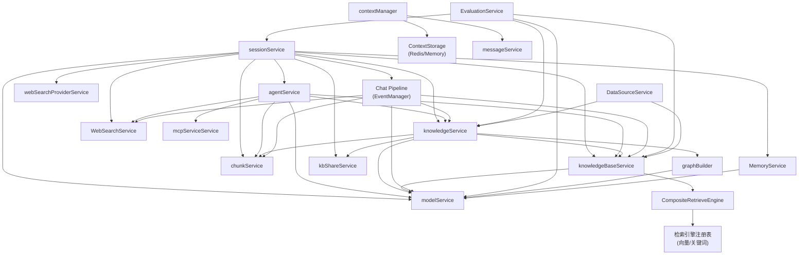

# WeKnora 业务逻辑层设计文档

> 本文档基于 `internal/application/service/` 目录下的源码分析撰写，描述 WeKnora 核心业务逻辑层的设计。

---

## 1. Service 层概览

### 1.1 所有 Service 的职责列表

| Service | 文件 | 核心职责 |
|---|---|---|
| `knowledgeBaseService` | `knowledgebase.go` | 知识库的 CRUD、配置管理、状态统计 |
| `knowledgeService` | `knowledge.go` | 知识文档上传、URL 导入、手动录入、解析调度、向量化入库 |
| `chunkService` | `chunk.go` | 分块的增删改查、手动编辑分块、重新向量化 |
| `sessionService` | `session.go` + `session_knowledge_qa.go` + `session_agent_qa.go` | 会话生命周期管理、RAG 问答、Agent 问答 |
| `agentService` | `agent_service.go` | Agent 引擎创建、工具注册、技能管理、MCP 工具集成 |
| `customAgentService` | `custom_agent.go` | 自定义 Agent 配置的 CRUD、权限管理、共享 Agent |
| `modelService` | `model.go` | LLM/Embedding/Rerank/VLM/ASR 模型的注册与实例化 |
| `DataSourceService` | `datasource_service.go` | 外部数据源配置、Cron 调度、增量同步 |
| `mcpServiceService` | `mcp_service.go` | MCP 服务配置的 CRUD、内置服务管理 |
| `WebSearchService` | `web_search.go` | 网络搜索执行、提供商路由、RAG 压缩 |
| `webSearchProviderService` | `web_search_provider.go` | 搜索提供商实体的 CRUD |
| `WebSearchStateService` | `web_search_state.go` | 会话维度的网络搜索开关状态持久化 |
| `EvaluationService` | `evaluation.go` | 评测任务的创建、执行、指标计算 |
| `graphBuilder` | `graph.go` | 知识图谱实体抽取、关系抽取、权重计算 |
| `kbShareService` | `kbshare.go` | 知识库跨组织共享、权限校验 |
| `organizationService` | `organization.go` | 组织与成员管理 |
| `tenantService` | `tenant.go` | 租户配置管理 |
| `userService` | `user.go` | 用户账号管理 |
| `KnowledgeTagService` | `tag.go` | 知识标签的 CRUD |
| `messageService` | `message.go` | 消息持久化、历史查询 |
| `skillService` | `skill_service.go` | 技能文件加载与元数据管理 |
| `ImageMultimodalService` | `image_multimodal.go` | 图片 OCR 和 VLM Caption 异步处理 |
| `MemoryService` | `memory/service.go` | 会话记忆实体/关系图谱提取与检索 |
| ChatPipeline 插件集 | `chat_pipeline/` | 问答管道各阶段：历史加载、Query 理解、搜索、Rerank、合并、生成 |
| `CompositeRetrieveEngine` | `retriever/composite.go` | 组合多个检索引擎（向量+关键词）并发执行 |
| `contextManager` | `llmcontext/context_manager.go` | LLM 对话上下文的缓存读写与 DB 冷启动重建 |

### 1.2 Service 之间的依赖关系



---

## 2. 知识库管理

### 2.1 知识库的创建、更新、删除流程

**创建流程**（`knowledgeBaseService.CreateKnowledgeBase`）：

1. 生成 UUID 作为知识库 ID
2. 从 Context 中绑定租户 ID（多租户隔离）
3. 调用 `EnsureDefaults()` 填充默认配置（检索策略、分块策略等）
4. 写入数据库

**更新流程**：

- 更新配置字段后，若 Embedding 模型变更，系统会触发异步重新向量化任务（通过 `asynq` 任务队列）

**删除流程**：

- 级联删除关联的知识文档（Knowledge）和分块（Chunk）
- 在向量数据库中删除对应的向量索引
- 删除分块前会先解除向量存储中的数据

**列表查询**（`ListKnowledgeBases`）：

- 对 Document 类型知识库，统计知识文档数量（`KnowledgeCount`）
- 对 FAQ 类型知识库，统计 Chunk 数量（`ChunkCount`）
- 额外查询 `pending`/`processing` 状态的文档数，为前端展示处理中状态

### 2.2 知识库的配置项

知识库（`types.KnowledgeBase`）支持的核心配置项：

| 配置项 | 说明 |
|---|---|
| `Type` | 知识库类型：`document`（文档型）/ `faq`（问答对型） |
| `EmbeddingModelID` | 向量化模型 ID |
| `StorageEngineConfig` | 存储引擎配置（COS / MinIO 等） |
| `VLMConfig` | 多模态视觉语言模型配置（用于图片 OCR） |
| `ASRConfig` | 语音识别模型配置（用于音频转文字） |
| `ChunkingStrategy` | 分块策略（固定大小、语义分块等） |
| `RetrievalConfig` | 检索配置（向量阈值、关键词阈值、TopK） |

知识库通过 `EnsureDefaults()` 方法在读取时补全缺省值，保证向后兼容。

### 2.3 共享知识库机制

共享由 `kbShareService` 负责，核心设计如下：

- **共享目标**：知识库可以共享给某个组织（Organization），而非单个用户
- **权限粒度**：共享时指定权限级别（`viewer` / `editor` / `admin`）；只有组织内 editor 及以上角色的用户才可发起共享
- **跨租户检索**：检索时若检测到 KB 属于其他租户（`kb.TenantID != currentTenantID`），会自动切换到源租户的 Embedding 模型，确保向量空间兼容
- **批量跨租户查找**：`fetchKnowledgeDataWithShared`、`listChunksByIDWithShared` 在当前租户查不到数据时，会尝试通过共享权限查找其他租户的数据
- **共享 Agent**：自定义 Agent 也支持跨组织共享，`customAgentService` 中包含对应的权限校验逻辑

---

## 3. 知识处理流水线

### 3.1 知识文档从上传到可检索的完整流程

```
用户上传文件 / URL / 手动录入
        ↓
1. 校验（文件类型、存储引擎配置、VLM/ASR 配置完整性）
        ↓
2. 去重（计算 MD5 Hash，对比 Hash+文件名+大小）
        ↓
3. 文件上传到对象存储（COS / MinIO）
        ↓
4. 创建 Knowledge 记录（status: pending）
        ↓
5. 入队异步解析任务（asynq）
        ↓
6. 文档解析（docparser/mineru/docreader 微服务）
        ↓
7. OCR 清洗（sanitizeOCRText，去除 HTML 标签、过滤空响应）
        ↓
8. 分块（chunker，按策略切分为 Chunk 列表）
        ↓
9. 向量化（Embedding 模型批量生成向量）
        ↓
10. 写入向量数据库 + 关系型数据库
        ↓
11. （可选）图片 Chunk 触发 ImageMultimodal 任务 → VLM OCR + Caption
        ↓
12. （可选）知识图谱抽取任务 → 实体/关系写入 Neo4j
        ↓
Knowledge 状态更新为 active，可被检索
```

### 3.2 文档解析 → 分块 → 向量化 → 入库的每个步骤

**文档解析**：

- 通过 `documentReader`（`interfaces.DocumentReader`）接入解析基础设施
- 支持 Parser Engine 覆盖配置：租户可在 UI 配置 MinerU 端点、API Key 等，通过 `getParserEngineOverridesFromContext` 注入
- 解析结果包含文本段落、图片引用、表格等结构化内容

**分块**（`internal/infrastructure/chunker`）：

- 固定大小分块：按字符数或 Token 数分割
- 语义分块：基于段落/句子边界
- 每个 Chunk 保留原文的 `StartPos` / `EndPos` 位置信息，用于后续邻近 Chunk 扩展

**向量化**：

- 使用 `embedding.Embedder` 接口批量处理
- 支持连接池（`EmbedderPooler`）提高吞吐
- 向量维度随模型不同而变化

**入库**：

- 关系型数据库：持久化 Chunk 的文本内容、元数据、位置信息
- 向量数据库：存储向量及关联的 KnowledgeBaseID、ChunkID 用于后续检索

### 3.3 支持的文档格式

通过 `isValidFileType` 和 `getFileType` 函数判断，支持：

| 格式 | 处理方式 |
|---|---|
| PDF | 文档解析器提取文本 + 图片；支持 MinerU 解算 |
| Word（docx/doc） | 文档解析器提取文本和表格 |
| Excel/CSV | 解析为表格数据，并可通过 LLM 生成表格描述（`extract.go` 中的 `tableDescriptionPromptTemplate`） |
| Markdown / TXT | 直接分块处理 |
| HTML | 转换为 Markdown 后处理 |
| 图片（PNG/JPG/etc） | 触发 `ImageMultimodalService`，进行 OCR 和 Caption |
| 音频（MP3/WAV/etc） | 触发 ASR（语音识别）后转文字再处理 |
| URL | 抓取网页内容后按文档处理 |
| FAQ 批量导入 | 按批（每批 50 条）解析 CSV/Excel，直接创建 Chunk |

### 3.4 OCR 和多模态图像处理

**ImageMultimodalService**（`image_multimodal.go`）作为 asynq 异步任务处理器：

1. 从对象存储下载图片（通过 `FileService` 解析 `provider://` URL）
2. **OCR**：调用 VLM 模型，使用 `vlmOCRPrompt`（提取 Markdown 格式文字，包含表格、公式）；结果经 `sanitizeOCRText` 清洗（去除 HTML 套壳、过滤空响应）
3. **Caption**：调用 VLM 模型，使用 `vlmCaptionPrompt` 生成中文图片描述
4. 创建子 Chunk 保存 OCR 文字和 Caption 文本，并向量化入库

**OCR 清洗**（`ocr_sanitizer.go`）关键逻辑：

- 剥离模型输出的 Markdown 代码块包装（` ```html\n...\n``` `）
- 将纯 HTML 响应转换为 Markdown
- 过滤已知空响应词（"无文字内容"、"no text content" 等）
- 合并多余空行

---

## 4. 检索与问答

### 4.1 快速问答（RAG）流程

```
用户提问
    ↓
sessionService.KnowledgeQA()
    ↓
构建 ChatManage 对象（携带 KB IDs、模型 ID、向量/关键词阈值等）
    ↓
Chat Pipeline 顺序触发以下事件：
    ↓
[LOAD_HISTORY] PluginLoadHistory
  → 加载最近 N 轮对话历史（MaxRounds 配置）
    ↓
[QUERY_UNDERSTAND] PluginQueryUnderstand
  → 基于历史改写 Query（多模态时使用 VLM 解析图片并拼入描述）
  → 判断 Intent（是否需要检索、纯聊天等）
    ↓
[CHUNK_SEARCH] PluginSearch
  → 并发执行：KB 混合检索 + 网络搜索（若启用）
  → KB 检索调用 knowledgeBaseService.HybridSearch()
    → 向量检索 + 关键词检索同时触发
    → RRF 融合：vectorWeight=0.7, keywordWeight=0.3, k=60
  → 若初始召回不足，触发 Query Expansion 补充检索
    ↓
[CHUNK_RERANK] PluginRerank
  → 调用 Rerank 模型对候选 Chunks 重排
  → 阈值降级：若无结果且原阈值>0.3，尝试降到 70% 再试
    ↓
[CHUNK_MERGE] PluginMerge
  → 去重（ID + 内容签名）
  → 注入历史相关引用
  → 解析父 Chunk（子→父内容）
  → 合并同源相邻区间（按 StartPos/EndPos 合并重叠段）
  → FAQ 问答对填充
  → 扩展短上下文（邻近 Chunk）
    ↓
[CHAT_COMPLETION] PluginChatCompletion
  → 将合并后的 Context 组装为 LLM Prompt
  → 调用 Chat 模型生成答案
  → 流式返回 token 到 EventBus
    ↓
答案通过 SSE/WebSocket 推送给用户
```

### 4.2 智能推理（Agent）流程

```
用户提问
    ↓
sessionService.AgentQA()
    ↓
构建 AgentConfig（KB、工具列表、系统提示、多轮配置）
    ↓
加载历史上下文（ContextManager，支持 Redis 缓存 + DB 冷启动重建）
    ↓
创建 AgentEngine（agent.NewAgentEngine）
  注册工具：
    - KB 检索工具（HybridSearch）
    - 网络搜索工具
    - 代码执行（沙箱）
    - 数据分析（DuckDB）
    - MCP 外部工具（SSE/HTTP 协议）
    - 技能（Skills，YAML 定义的复合工具）
    ↓
Agent 迭代推理（最多 MAX_ITERATIONS=100 轮）：
  1. LLM 生成 Thought + Tool Call
  2. 执行对应工具
  3. 工具结果（含 MCP 图片结果 → VLM 生成文字描述）注入上下文
  4. 判断是否 Final Answer，否则继续
    ↓
流式输出推理过程（思考步骤 + 工具调用结果）
    ↓
最终答案通过 EventBus 推送给用户
```

### 4.3 混合检索策略

`knowledgeBaseService.HybridSearch()` 执行策略：

1. **向量检索**（VectorRetrieverType）：
   - 计算 Query Embedding（跨租户时使用源租户的模型）
   - 向量相似度阈值过滤（`VectorThreshold`）
   - 支持预计算 Embedding 复用（多 KB 共享模型时避免重复调用）

2. **关键词检索**（KeywordsRetrieverType）：
   - BM25 或倒排索引检索
   - 仅对 Document 类型 KB 启用；FAQ 类型只用向量

3. **过量检索 + 融合**：
   - 实际检索量 = `max(TopK×5, 50) × KB数量`（上限 1000）
   - 双路结果通过 **RRF（Reciprocal Rank Fusion）** 融合
   - RRF 公式：$score = \frac{0.7}{60 + rank_{vector}} + \frac{0.3}{60 + rank_{keyword}}$

4. **FAQ 特殊处理**（`applyFAQPostProcessing`）：
   - 若结果不足，触发迭代检索（最多 5 次，每次扩大 TopK）
   - 负向问题过滤（过滤掉与 Query 语义相反的 FAQ 条目）

### 4.4 Rerank 重排机制

`PluginRerank`（`chat_pipeline/rerank.go`）：

- 过滤 `DirectLoad` 类型结果（直接引用，跳过重排）
- 拼接 Content + ImageInfo 提取 passage（处理多模态 Chunk）
- 跳过内容为空的 passage
- 调用 Rerank 模型（接口 `rerank.Reranker`）返回 `(index, score)` 列表
- **阈值降级**：若结果为空且原阈值 > 0.3，降至 70% 后重试
- DirectLoad 结果固定追加到结果末尾

### 4.5 Chat Pipeline 的设计和各阶段

Chat Pipeline 采用 **插件 + 事件总线** 模式（`EventManager` + `Plugin` 接口）：

| 事件类型 | 插件 | 职责 |
|---|---|---|
| `LOAD_HISTORY` | `PluginLoadHistory` | 加载最近 N 轮历史消息 |
| `QUERY_UNDERSTAND` | `PluginQueryUnderstand` | Query 改写 + Intent 分类 + 多模态图片描述 |
| `CHUNK_SEARCH` | `PluginSearch` | 并发 KB 检索 + 网络搜索 + Query Expansion |
| `CHUNK_RERANK` | `PluginRerank` | 候选 Chunk Rerank + 阈值降级 |
| `CHUNK_MERGE` | `PluginMerge` | 去重、父 Chunk 解析、区间合并、短上下文扩展 |
| `CHAT_COMPLETION` | `PluginChatCompletion` | LLM 生成答案（流式/非流式） |
| `CHAT_COMPLETION_STREAM` | `PluginChatCompletionStream` | 流式版本的 LLM 生成 |

Pipeline 通过链式 `next()` 调用实现中间件模式，任意插件可中断或修改后续执行。

---

## 5. 会话管理

### 5.1 会话创建和生命周期

- **创建**（`CreateSession`）：绑定 TenantID，生成 UUID Session ID，持久化到数据库
- **查询**：`GetSession`（按 ID）、`GetSessionsByTenant`（列出租户所有会话）
- **生命周期**：会话无内置 TTL，由用户或管理员显式删除；对话历史随会话持久化

SessionService 结构体聚合了问答所需的全部依赖：KB 服务、模型服务、Agent 服务、EventManager、ContextManager、WebSearch 服务、Memory 服务等。

### 5.2 消息历史管理

- **持久化**：每轮问答的 User Message 和 Assistant Message 均写入 `MessageRepository`
- **历史加载**：`PluginLoadHistory` 从 DB 加载最近 `MaxRounds` 轮（配置项），返回结构化 `History` 列表
- **历史限制**：RAG 模式下通过 `HistoryTurns` 字段控制带入 LLM 的轮数；Agent 模式下由 `ContextManager` 统一管理

### 5.3 会话记忆（Memory）机制

`MemoryService`（`memory/service.go`）实现基于知识图谱的长期记忆：

**AddEpisode 流程**：
1. 将最近多条消息拼接为对话字符串
2. 调用 LLM（`extractGraphPrompt`）提取实体（Entity）和关系（Relationship），输出 JSON
3. 生成 Episode 对象（含摘要、实体列表、关系列表）
4. 写入 Memory Repository（需 Neo4j 或兼容图数据库支持）

**RetrieveMemory 流程**：
1. 调用 LLM（`extractKeywordsPrompt`）从 Query 中提取关键词
2. 在图谱中搜索相关实体和关系
3. 返回 `MemoryContext`（相关记忆片段），注入到 LLM Prompt 中

Memory 功能依赖 Repository 的 `IsAvailable()` 检查，不可用时优雅降级（仅警告，不报错）。

### 5.4 流式响应处理

- 问答结果通过 `event.EventBus` 事件总线传播
- EventBus 封装 SSE/WebSocket 推送逻辑
- ChatPipeline 各插件通过 `chatManage.PipelineContext.EventBus` 发布事件：
  - 引用来源（References）
  - Answer Token 流（Chunk）
  - 思考步骤（Thinking，Agent 模式）
  - 工具调用结果（Tool Call，Agent 模式）
  - 完成事件（Done）
- `ContextManager` 在流式完成后将完整消息写入缓存和持久化存储

---

## 6. 数据源自动同步

### 6.1 数据源类型

通过 `ConnectorRegistry` 注册各类外部数据源连接器，支持：

- **飞书（Feishu）**：文档、知识库
- 其他通过接口扩展（`interfaces.DataSourceConnector`）的数据源类型

### 6.2 自动同步机制和调度

`DataSourceService` 的同步架构：

- **调度器**：`datasource.Scheduler`（基于 Cron 表达式调度）
  - 创建数据源时，若配置了 `SyncSchedule` 且状态为 Active，自动注册 Cron 任务
  - 更新时通过 `AddOrUpdate` 更新调度
  - 删除时移除 Cron 任务
- **任务执行**：触发时通过 `asynq` 任务队列推送同步任务，解耦调度与执行
- **同步日志**：每次同步的结果（成功/失败/同步文件数）记录在 `SyncLogRepository`，`ListDataSources` 时附带最新同步日志

### 6.3 增量同步 vs 全量同步

- **增量同步**：Connector 记录上次同步时间（或游标），只拉取变更内容
- **全量同步**：忽略上次同步记录，重新拉取所有内容
- 具体策略由各 Connector 实现，`SyncDataSource` 方法接受 `force` 参数控制是否全量
- 入库前会调用 `knowledgeService.CheckKnowledgeExists` 进行 Hash 去重，避免重复创建

---

## 7. 网络搜索

### 7.1 支持的搜索引擎

通过 `types.WebSearchProviderType` 枚举定义，当前支持：

| 提供商 | 类型常量 |
|---|---|
| Bing | `WebSearchProviderTypeBing` |
| Google | `WebSearchProviderTypeGoogle` |
| DuckDuckGo | `WebSearchProviderTypeDuckDuckGo` |
| Tavily | `WebSearchProviderTypeTavily` |

### 7.2 搜索提供商抽象层

**两层抽象设计**：

- **`WebSearchProviderEntity`**（DB 实体）：租户在 UI 配置的搜索提供商实例，包含 Provider 类型 + API Key 等参数，支持设置默认提供商
- **`infra_web_search.Registry`**（基础设施层）：工厂注册表，根据 Provider 类型创建 `WebSearchProvider` 接口实例

**Provider 解析优先级**（`resolveProvider`）：
1. 按 `providerID` 从 DB 加载配置（新路径）
2. 降级到 `WebSearchConfig.Provider` 字段（向后兼容）

### 7.3 搜索结果处理流程

1. **执行搜索**：调用对应 Provider 的 `Search(ctx, query, maxResults, includeDate)`
2. **黑名单过滤**：过滤配置在 `WebSearchConfig.Blacklist` 中的域名
3. **RAG 压缩**（可选，`CompressWithRAG`）：
   - 创建临时隐藏知识库（不在列表显示）
   - 将搜索结果写入临时 KB 并向量化
   - 使用 RAG 检索压缩，提取与 Query 相关的片段
   - 会话结束后临时 KB 自动清理
4. **网页抓取**（可选，`web_fetch.go`）：对搜索结果中的 URL 抓取完整正文，提升上下文质量

---

## 8. 评测系统

### 8.1 评测的设计和流程

`EvaluationService`（`evaluation.go`）采用内存任务存储（`evaluationMemoryStorage`）管理评测任务生命周期：

评测数据模型：
- **Corpus**：知识片段集（pid → content）
- **Queries**：问题集（qid → content）
- **Answers**：标准答案集（aid → content）
- **Qrels**：问题到知识片段的相关性映射（qid → pid）
- **Arels**：问题到标准答案的映射（qid → aid）

**评测执行流程**：

1. 创建评测任务（绑定 KB 和 Dataset）
2. 并发执行评测（`errgroup` + `sync` 并发控制，利用机器 CPU 核数）
3. 对每个 Query：
   a. 调用 `knowledgeBaseService.HybridSearch` 检索候选 Chunks
   b. 调用 `sessionService` 生成答案
   c. 对比检索结果与 Qrels 计算检索指标
   d. 对比生成答案与 Arels（可调用 LLM 评分）

### 8.2 评测指标

检索阶段指标（基于 Qrels）：

| 指标 | 说明 |
|---|---|
| Precision@K | 前 K 个检索结果中相关文档的比例 |
| Recall@K | 前 K 个结果覆盖了多少相关文档 |
| MRR（Mean Reciprocal Rank） | 第一个相关结果的排名倒数的均值 |
| NDCG@K | 考虑位置权重的归一化折损累积增益 |

生成阶段指标（基于 Arels）：

| 指标 | 说明 |
|---|---|
| 精确匹配率 | 答案与标准答案完全一致的比例 |
| LLM 评分 | 通过 LLM 对答案质量打分（0-1） |

---

## 9. 知识图谱

### 9.1 知识图谱的构建方式

**触发条件**：通过环境变量 `NEO4J_ENABLE=true` 启用；知识入库时，每个 Chunk 触发 `ExtractChunk` 异步任务。

**`graphBuilder` 构建流程**（`graph.go`）：

**第一阶段：实体抽取**（`extractEntities`）：

1. 对每个 Chunk 调用 LLM（使用 `ExtractEntitiesPrompt` 配置的模板，支持多语言 `{{language}}` 占位符）
2. 解析 LLM 返回 JSON，获取实体列表（title + type + description）
3. 实体去重（按 title 索引，相同 title 合并描述）
4. 最大并发 4（`MaxConcurrentEntityExtractions`）

**第二阶段：关系抽取**（`extractRelationships`）：

1. 确认存在 ≥2 个实体（`MinEntitiesForRelation`）
2. 按批（`DefaultRelationBatchSize=5`）对实体对调用 LLM 抽取关系
3. 最大并发 4（`MaxConcurrentRelationExtractions`）

**第三阶段：权重计算**：

关系权重综合 PMI（点互信息）和强度两个维度：
$$weight = PMIWeight \times PMI + StrengthWeight \times strength$$
其中 `PMIWeight=0.6`, `StrengthWeight=0.4`，结果归一化到 1-10 范围。

间接关系（两跳）权重衰减系数 `IndirectRelationWeightDecay=0.5`。

**第四阶段：写入图数据库**：

- 实体、关系写入 Neo4j（或兼容存储）
- 通过 `interfaces.RetrieveGraphRepository` 接口解耦存储实现

### 9.2 图谱查询和使用

**Memory 服务中的记忆检索**（`memory/service.go`）：

1. LLM 从用户 Query 中提取关键词
2. 以关键词在 Neo4j 中查找相关实体和关系
3. 返回与用户历史记忆相关的上下文，注入到当前对话

**Agent 工具调用**：

- Agent 引擎可通过注册的工具调用知识图谱查询接口
- 图谱数据可辅助 Agent 构建更丰富的推理上下文

**知识库层面的图谱辅助检索**（`kbshare.go` 中的 `graphEngine`）：

- `retrieveGraphRepository` 接口预留了基于图谱的邻居扩展检索能力
- 当前版本中图谱功能依赖 Neo4j，通过 `NEO4J_ENABLE` 开关控制启用
