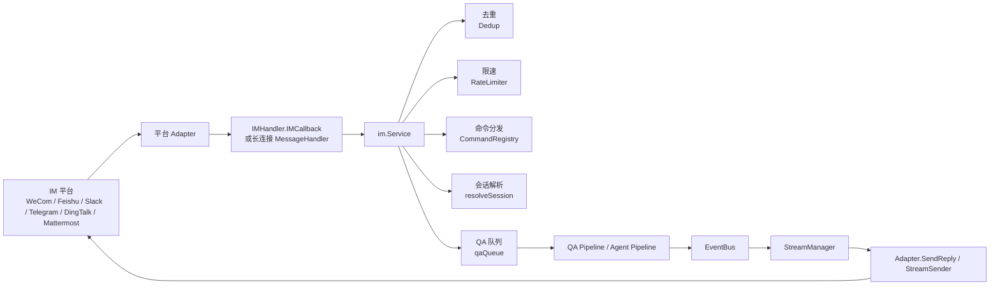

# 05 API 与集成层

本文基于 WeKnora 当前代码实现分析 HTTP API 路由、Handler 层、中间件、IM 即时通讯集成、流式传输、事件系统与 Go SDK。对应核心代码主要位于：

- `internal/router/`
- `internal/handler/`
- `internal/middleware/`
- `internal/im/`
- `internal/stream/`
- `internal/event/`
- `docs/swagger.yaml`
- `client/`

补充说明：`internal/router/task.go` 与 `internal/router/sync_task.go` 不是 HTTP 路由，而是后台任务“路由器”。标准模式使用 Asynq + Redis，Lite 模式使用 `SyncTaskExecutor` 在进程内异步执行，用于文档处理、FAQ 导入、知识库复制/移动、数据源同步等后台任务。

## 1. API 设计总览

### 1.1 API 分组和版本管理

- 主业务 API 统一挂在 `/api/v1` 下。
- 非版本化辅助端点包括：`/health`、`/files`、`/swagger/*any`。
- Swagger 文档的 `basePath` 也是 `/api/v1`，由 `docs/swagger.yaml` 与 `docs/docs.go` 生成。
- 当前代码中没有 `/api/v2` 或版本协商机制，版本策略是固定前缀式版本化。
- IM 回调虽然也是业务入口，但独立注册在 `/api/v1/im/callback/:channel_id`，并在认证中间件之前挂载。

### 1.2 RESTful 设计风格

WeKnora 整体上采用“资源 CRUD + 操作型端点”的混合风格：

- 资源型接口遵循 REST 风格：如 `/knowledge-bases`、`/knowledge`、`/sessions`、`/models`、`/agents`。
- 编排/工作流接口使用动作式命名：如 `/generate_title`、`/stop`、`/copy`、`/test`、`/move`、`/sync`。
- 聊天接口采用命令式入口而不是资源子路由：`/knowledge-chat/:session_id`、`/agent-chat/:session_id`、`/knowledge-search`。
- IM 接入是“平台回调 + 管理 API”双层设计：回调用于接收消息，管理 API 用于配置渠道。

这种设计对前端和 SDK 更直接，代价是 Swagger 注解与真实路由偶有漂移，尤其是会话聊天相关注解仍保留部分旧路径。

### 1.3 认证方式

#### JWT

- 请求头：`Authorization: Bearer <token>`
- 中间件调用 `userService.ValidateToken()` 验证。
- 成功后向 Gin Context 与 `context.Context` 注入：`tenant_id`、`tenant`、`user`、`user_id`。
- 支持通过 `X-Tenant-ID` 请求头切换目标租户，但前提是：
  - 配置 `Tenant.EnableCrossTenantAccess=true`
  - 用户 `CanAccessAllTenants=true`
  - 目标租户存在

#### API Key

- 请求头：`X-API-Key: <api_key>`
- 中间件通过 `tenantService.ExtractTenantIDFromAPIKey()` 解析租户。
- 然后校验数据库里的 `tenant.APIKey` 是否一致。
- 若找不到租户对应用户，会构造一个“系统虚拟用户”放入上下文，保证下游 Handler 对 `UserContextKey` 的依赖不崩溃。
- 这也是当前 Go SDK 默认使用的认证方式。

#### OIDC

- 前端只发起跳转，不直接向 OIDC Provider 换 token。
- 后端接口：
  - `GET /api/v1/auth/oidc/config`
  - `GET /api/v1/auth/oidc/url`
  - `GET /api/v1/auth/oidc/callback`
- 后端负责：
  - 生成带 `state` 的授权地址
  - 接收 `code`
  - 向 OIDC Provider 换 token / userinfo
  - 自动匹配或创建本地用户与默认租户
  - 签发 WeKnora 自己的 JWT 与 `refresh_token`
- 回调结果不会直接作为 query 参数返回，而是序列化后 base64url 编码到 `#oidc_result=...`，由前端解析并再请求 `/api/v1/auth/me` 完成登录态补齐。

### 1.4 完整 API 路由表

下面按模块列出路由、HTTP 方法与对应 Handler 函数。`/api/v1` 前缀默认省略时会明确写出。

#### 辅助与非业务端点

| 方法 | 路径 | Handler | 说明 |
| --- | --- | --- | --- |
| GET | `/health` | 内联匿名函数 | 健康检查 |
| GET | `/swagger/*any` | `ginSwagger.WrapHandler(...)` | Swagger 文档，非 release 模式启用 |
| GET | `/files?file_path=...` | 内联匿名函数 | 统一代理本地/对象存储文件读取 |
| GET | `/api/v1/im/callback/:channel_id` | `IMHandler.IMCallback` | IM 平台 URL 验证/回调 |
| POST | `/api/v1/im/callback/:channel_id` | `IMHandler.IMCallback` | IM 平台消息回调 |

#### 认证 Auth

| 方法 | 路径 | Handler | 说明 |
| --- | --- | --- | --- |
| POST | `/api/v1/auth/register` | `AuthHandler.Register` | 用户注册 |
| POST | `/api/v1/auth/login` | `AuthHandler.Login` | 用户登录 |
| GET | `/api/v1/auth/oidc/config` | `AuthHandler.GetOIDCConfig` | 获取 OIDC 配置 |
| GET | `/api/v1/auth/oidc/url` | `AuthHandler.GetOIDCAuthorizationURL` | 获取 OIDC 授权地址 |
| GET | `/api/v1/auth/oidc/callback` | `AuthHandler.OIDCRedirectCallback` | OIDC 回调 |
| POST | `/api/v1/auth/refresh` | `AuthHandler.RefreshToken` | 刷新 token |
| GET | `/api/v1/auth/validate` | `AuthHandler.ValidateToken` | 验证 token |
| POST | `/api/v1/auth/logout` | `AuthHandler.Logout` | 登出 |
| GET | `/api/v1/auth/me` | `AuthHandler.GetCurrentUser` | 当前用户信息 |
| POST | `/api/v1/auth/change-password` | `AuthHandler.ChangePassword` | 修改密码 |

#### 租户 Tenant

| 方法 | 路径 | Handler | 说明 |
| --- | --- | --- | --- |
| GET | `/api/v1/tenants/all` | `TenantHandler.ListAllTenants` | 跨租户获取全部租户 |
| GET | `/api/v1/tenants/search` | `TenantHandler.SearchTenants` | 跨租户搜索租户 |
| POST | `/api/v1/tenants` | `TenantHandler.CreateTenant` | 创建租户 |
| GET | `/api/v1/tenants/:id` | `TenantHandler.GetTenant` | 获取租户 |
| PUT | `/api/v1/tenants/:id` | `TenantHandler.UpdateTenant` | 更新租户 |
| DELETE | `/api/v1/tenants/:id` | `TenantHandler.DeleteTenant` | 删除租户 |
| GET | `/api/v1/tenants` | `TenantHandler.ListTenants` | 当前范围租户列表 |
| GET | `/api/v1/tenants/kv/:key` | `TenantHandler.GetTenantKV` | 获取租户 KV 配置 |
| PUT | `/api/v1/tenants/kv/:key` | `TenantHandler.UpdateTenantKV` | 更新租户 KV 配置 |

#### 知识库 Knowledge Base

| 方法 | 路径 | Handler | 说明 |
| --- | --- | --- | --- |
| POST | `/api/v1/knowledge-bases` | `KnowledgeBaseHandler.CreateKnowledgeBase` | 创建知识库 |
| GET | `/api/v1/knowledge-bases` | `KnowledgeBaseHandler.ListKnowledgeBases` | 知识库列表 |
| GET | `/api/v1/knowledge-bases/:id` | `KnowledgeBaseHandler.GetKnowledgeBase` | 知识库详情 |
| PUT | `/api/v1/knowledge-bases/:id` | `KnowledgeBaseHandler.UpdateKnowledgeBase` | 更新知识库 |
| DELETE | `/api/v1/knowledge-bases/:id` | `KnowledgeBaseHandler.DeleteKnowledgeBase` | 删除知识库 |
| PUT | `/api/v1/knowledge-bases/:id/pin` | `KnowledgeBaseHandler.TogglePinKnowledgeBase` | 置顶/取消置顶 |
| GET | `/api/v1/knowledge-bases/:id/hybrid-search` | `KnowledgeBaseHandler.HybridSearch` | 混合搜索 |
| POST | `/api/v1/knowledge-bases/copy` | `KnowledgeBaseHandler.CopyKnowledgeBase` | 复制知识库 |
| GET | `/api/v1/knowledge-bases/copy/progress/:task_id` | `KnowledgeBaseHandler.GetKBCloneProgress` | 复制进度 |
| GET | `/api/v1/knowledge-bases/:id/move-targets` | `KnowledgeBaseHandler.ListMoveTargets` | 获取知识移动目标 |

#### 标签 Tag

| 方法 | 路径 | Handler | 说明 |
| --- | --- | --- | --- |
| GET | `/api/v1/knowledge-bases/:id/tags` | `TagHandler.ListTags` | 标签列表 |
| POST | `/api/v1/knowledge-bases/:id/tags` | `TagHandler.CreateTag` | 创建标签 |
| PUT | `/api/v1/knowledge-bases/:id/tags/:tag_id` | `TagHandler.UpdateTag` | 更新标签 |
| DELETE | `/api/v1/knowledge-bases/:id/tags/:tag_id` | `TagHandler.DeleteTag` | 删除标签 |

#### 知识 Knowledge

| 方法 | 路径 | Handler | 说明 |
| --- | --- | --- | --- |
| POST | `/api/v1/knowledge-bases/:id/knowledge/file` | `KnowledgeHandler.CreateKnowledgeFromFile` | 文件导入知识 |
| POST | `/api/v1/knowledge-bases/:id/knowledge/url` | `KnowledgeHandler.CreateKnowledgeFromURL` | URL/网页导入知识 |
| POST | `/api/v1/knowledge-bases/:id/knowledge/manual` | `KnowledgeHandler.CreateManualKnowledge` | 手工录入 Markdown |
| GET | `/api/v1/knowledge-bases/:id/knowledge` | `KnowledgeHandler.ListKnowledge` | 知识列表 |
| DELETE | `/api/v1/knowledge-bases/:id/knowledge` | `KnowledgeHandler.ClearKnowledgeBaseContents` | 清空知识库内容 |
| GET | `/api/v1/knowledge/batch` | `KnowledgeHandler.GetKnowledgeBatch` | 批量获取知识 |
| GET | `/api/v1/knowledge/:id` | `KnowledgeHandler.GetKnowledge` | 获取知识详情 |
| DELETE | `/api/v1/knowledge/:id` | `KnowledgeHandler.DeleteKnowledge` | 删除知识 |
| PUT | `/api/v1/knowledge/:id` | `KnowledgeHandler.UpdateKnowledge` | 更新知识 |
| PUT | `/api/v1/knowledge/manual/:id` | `KnowledgeHandler.UpdateManualKnowledge` | 更新手工知识 |
| POST | `/api/v1/knowledge/:id/reparse` | `KnowledgeHandler.ReparseKnowledge` | 重新解析 |
| GET | `/api/v1/knowledge/:id/download` | `KnowledgeHandler.DownloadKnowledgeFile` | 下载原始文件 |
| GET | `/api/v1/knowledge/:id/preview` | `KnowledgeHandler.PreviewKnowledgeFile` | 预览文件 |
| PUT | `/api/v1/knowledge/image/:id/:chunk_id` | `KnowledgeHandler.UpdateImageInfo` | 更新图像分块信息 |
| PUT | `/api/v1/knowledge/tags` | `KnowledgeHandler.UpdateKnowledgeTagBatch` | 批量更新标签 |
| GET | `/api/v1/knowledge/search` | `KnowledgeHandler.SearchKnowledge` | 搜索知识 |
| POST | `/api/v1/knowledge/move` | `KnowledgeHandler.MoveKnowledge` | 移动知识 |
| GET | `/api/v1/knowledge/move/progress/:task_id` | `KnowledgeHandler.GetKnowledgeMoveProgress` | 移动进度 |

#### FAQ

| 方法 | 路径 | Handler | 说明 |
| --- | --- | --- | --- |
| GET | `/api/v1/knowledge-bases/:id/faq/entries` | `FAQHandler.ListEntries` | FAQ 条目列表 |
| GET | `/api/v1/knowledge-bases/:id/faq/entries/export` | `FAQHandler.ExportEntries` | 导出 FAQ |
| GET | `/api/v1/knowledge-bases/:id/faq/entries/:entry_id` | `FAQHandler.GetEntry` | FAQ 条目详情 |
| POST | `/api/v1/knowledge-bases/:id/faq/entries` | `FAQHandler.UpsertEntries` | 批量创建/更新 |
| POST | `/api/v1/knowledge-bases/:id/faq/entry` | `FAQHandler.CreateEntry` | 创建单条 FAQ |
| PUT | `/api/v1/knowledge-bases/:id/faq/entries/:entry_id` | `FAQHandler.UpdateEntry` | 更新 FAQ |
| POST | `/api/v1/knowledge-bases/:id/faq/entries/:entry_id/similar-questions` | `FAQHandler.AddSimilarQuestions` | 添加相似问题 |
| PUT | `/api/v1/knowledge-bases/:id/faq/entries/fields` | `FAQHandler.UpdateEntryFieldsBatch` | 批量更新字段 |
| PUT | `/api/v1/knowledge-bases/:id/faq/entries/tags` | `FAQHandler.UpdateEntryTagBatch` | 批量更新标签 |
| DELETE | `/api/v1/knowledge-bases/:id/faq/entries` | `FAQHandler.DeleteEntries` | 批量删除 |
| POST | `/api/v1/knowledge-bases/:id/faq/search` | `FAQHandler.SearchFAQ` | FAQ 搜索 |
| PUT | `/api/v1/knowledge-bases/:id/faq/import/last-result/display` | `FAQHandler.UpdateLastImportResultDisplayStatus` | 更新导入结果展示状态 |
| GET | `/api/v1/faq/import/progress/:task_id` | `FAQHandler.GetImportProgress` | FAQ 导入进度 |

#### 分块 Chunk

| 方法 | 路径 | Handler | 说明 |
| --- | --- | --- | --- |
| GET | `/api/v1/chunks/:knowledge_id` | `ChunkHandler.ListKnowledgeChunks` | 知识分块列表 |
| GET | `/api/v1/chunks/by-id/:id` | `ChunkHandler.GetChunkByIDOnly` | 直接按 chunk_id 获取 |
| DELETE | `/api/v1/chunks/:knowledge_id/:id` | `ChunkHandler.DeleteChunk` | 删除分块 |
| DELETE | `/api/v1/chunks/:knowledge_id` | `ChunkHandler.DeleteChunksByKnowledgeID` | 删除知识下全部分块 |
| PUT | `/api/v1/chunks/:knowledge_id/:id` | `ChunkHandler.UpdateChunk` | 更新分块 |
| DELETE | `/api/v1/chunks/by-id/:id/questions` | `ChunkHandler.DeleteGeneratedQuestion` | 删除生成问题 |

#### 会话 Session

| 方法 | 路径 | Handler | 说明 |
| --- | --- | --- | --- |
| POST | `/api/v1/sessions` | `session.Handler.CreateSession` | 创建会话 |
| DELETE | `/api/v1/sessions/batch` | `session.Handler.BatchDeleteSessions` | 批量删除会话 |
| GET | `/api/v1/sessions/:id` | `session.Handler.GetSession` | 会话详情 |
| GET | `/api/v1/sessions` | `session.Handler.GetSessionsByTenant` | 会话列表 |
| PUT | `/api/v1/sessions/:id` | `session.Handler.UpdateSession` | 更新会话 |
| DELETE | `/api/v1/sessions/:id` | `session.Handler.DeleteSession` | 删除会话 |
| DELETE | `/api/v1/sessions/:id/messages` | `session.Handler.ClearSessionMessages` | 清空消息 |
| POST | `/api/v1/sessions/:session_id/generate_title` | `session.Handler.GenerateTitle` | 生成标题 |
| POST | `/api/v1/sessions/:session_id/stop` | `session.Handler.StopSession` | 停止生成 |
| GET | `/api/v1/sessions/continue-stream/:session_id` | `session.Handler.ContinueStream` | 继续流式接收 |

#### 聊天与知识检索

| 方法 | 路径 | Handler | 说明 |
| --- | --- | --- | --- |
| POST | `/api/v1/knowledge-chat/:session_id` | `session.Handler.KnowledgeQA` | 基于知识库的 SSE 问答 |
| POST | `/api/v1/agent-chat/:session_id` | `session.Handler.AgentQA` | Agent SSE 问答 |
| POST | `/api/v1/knowledge-search` | `session.Handler.SearchKnowledge` | 纯检索，不生成答案 |

#### 消息 Message

| 方法 | 路径 | Handler | 说明 |
| --- | --- | --- | --- |
| POST | `/api/v1/messages/search` | `MessageHandler.SearchMessages` | 搜索历史消息 |
| GET | `/api/v1/messages/chat-history-stats` | `MessageHandler.GetChatHistoryKBStats` | 聊天历史索引统计 |
| GET | `/api/v1/messages/:session_id/load` | `MessageHandler.LoadMessages` | 分页/按时间加载消息 |
| DELETE | `/api/v1/messages/:session_id/:id` | `MessageHandler.DeleteMessage` | 删除消息 |

#### 模型 Model

| 方法 | 路径 | Handler | 说明 |
| --- | --- | --- | --- |
| GET | `/api/v1/models/providers` | `ModelHandler.ListModelProviders` | 模型供应商列表 |
| POST | `/api/v1/models` | `ModelHandler.CreateModel` | 创建模型 |
| GET | `/api/v1/models` | `ModelHandler.ListModels` | 模型列表 |
| GET | `/api/v1/models/:id` | `ModelHandler.GetModel` | 模型详情 |
| PUT | `/api/v1/models/:id` | `ModelHandler.UpdateModel` | 更新模型 |
| DELETE | `/api/v1/models/:id` | `ModelHandler.DeleteModel` | 删除模型 |

#### 评估 Evaluation

| 方法 | 路径 | Handler | 说明 |
| --- | --- | --- | --- |
| POST | `/api/v1/evaluation/` | `EvaluationHandler.Evaluation` | 执行评估 |
| GET | `/api/v1/evaluation/` | `EvaluationHandler.GetEvaluationResult` | 获取评估结果 |

#### 初始化 Initialization

| 方法 | 路径 | Handler | 说明 |
| --- | --- | --- | --- |
| GET | `/api/v1/initialization/config/:kbId` | `InitializationHandler.GetCurrentConfigByKB` | 获取 KB 当前配置 |
| POST | `/api/v1/initialization/initialize/:kbId` | `InitializationHandler.InitializeByKB` | 初始化知识库 |
| PUT | `/api/v1/initialization/config/:kbId` | `InitializationHandler.UpdateKBConfig` | 更新 KB 配置 |
| GET | `/api/v1/initialization/ollama/status` | `InitializationHandler.CheckOllamaStatus` | 检查 Ollama |
| GET | `/api/v1/initialization/ollama/models` | `InitializationHandler.ListOllamaModels` | 列出 Ollama 模型 |
| POST | `/api/v1/initialization/ollama/models/check` | `InitializationHandler.CheckOllamaModels` | 校验 Ollama 模型 |
| POST | `/api/v1/initialization/ollama/models/download` | `InitializationHandler.DownloadOllamaModel` | 下载 Ollama 模型 |
| GET | `/api/v1/initialization/ollama/download/progress/:taskId` | `InitializationHandler.GetDownloadProgress` | 下载进度 |
| GET | `/api/v1/initialization/ollama/download/tasks` | `InitializationHandler.ListDownloadTasks` | 下载任务列表 |
| POST | `/api/v1/initialization/remote/check` | `InitializationHandler.CheckRemoteModel` | 检查远程模型 |
| POST | `/api/v1/initialization/embedding/test` | `InitializationHandler.TestEmbeddingModel` | 测试 Embedding |
| POST | `/api/v1/initialization/rerank/check` | `InitializationHandler.CheckRerankModel` | 测试 Rerank |
| POST | `/api/v1/initialization/asr/check` | `InitializationHandler.CheckASRModel` | 测试 ASR |
| POST | `/api/v1/initialization/multimodal/test` | `InitializationHandler.TestMultimodalFunction` | 测试多模态 |
| POST | `/api/v1/initialization/extract/text-relation` | `InitializationHandler.ExtractTextRelations` | 提取文本关系 |
| POST | `/api/v1/initialization/extract/fabri-tag` | `InitializationHandler.FabriTag` | 抽取标签 |
| POST | `/api/v1/initialization/extract/fabri-text` | `InitializationHandler.FabriText` | 抽取文本 |

#### 系统 System

| 方法 | 路径 | Handler | 说明 |
| --- | --- | --- | --- |
| GET | `/api/v1/system/info` | `SystemHandler.GetSystemInfo` | 系统信息 |
| GET | `/api/v1/system/parser-engines` | `SystemHandler.ListParserEngines` | 解析引擎列表 |
| POST | `/api/v1/system/parser-engines/check` | `SystemHandler.CheckParserEngines` | 校验解析引擎 |
| POST | `/api/v1/system/docreader/reconnect` | `SystemHandler.ReconnectDocReader` | 重连 DocReader |
| GET | `/api/v1/system/storage-engine-status` | `SystemHandler.GetStorageEngineStatus` | 存储引擎状态 |
| POST | `/api/v1/system/storage-engine-check` | `SystemHandler.CheckStorageEngine` | 检查存储引擎 |
| GET | `/api/v1/system/minio/buckets` | `SystemHandler.ListMinioBuckets` | MinIO bucket 列表 |

#### MCP Service

| 方法 | 路径 | Handler | 说明 |
| --- | --- | --- | --- |
| POST | `/api/v1/mcp-services` | `MCPServiceHandler.CreateMCPService` | 创建 MCP 服务 |
| GET | `/api/v1/mcp-services` | `MCPServiceHandler.ListMCPServices` | 服务列表 |
| GET | `/api/v1/mcp-services/:id` | `MCPServiceHandler.GetMCPService` | 服务详情 |
| PUT | `/api/v1/mcp-services/:id` | `MCPServiceHandler.UpdateMCPService` | 更新服务 |
| DELETE | `/api/v1/mcp-services/:id` | `MCPServiceHandler.DeleteMCPService` | 删除服务 |
| POST | `/api/v1/mcp-services/:id/test` | `MCPServiceHandler.TestMCPService` | 测试连通性 |
| GET | `/api/v1/mcp-services/:id/tools` | `MCPServiceHandler.GetMCPServiceTools` | 获取工具列表 |
| GET | `/api/v1/mcp-services/:id/resources` | `MCPServiceHandler.GetMCPServiceResources` | 获取资源列表 |

#### Web Search

| 方法 | 路径 | Handler | 说明 |
| --- | --- | --- | --- |
| GET | `/api/v1/web-search/providers` | `WebSearchHandler.GetProviders` | 可用搜索供应商 |
| GET | `/api/v1/web-search-providers/types` | `WebSearchProviderHandler.ListProviderTypes` | 供应商类型元数据 |
| POST | `/api/v1/web-search-providers/test` | `WebSearchProviderHandler.TestProviderRaw` | 测试原始配置 |
| POST | `/api/v1/web-search-providers` | `WebSearchProviderHandler.CreateProvider` | 创建供应商配置 |
| GET | `/api/v1/web-search-providers` | `WebSearchProviderHandler.ListProviders` | 列表 |
| GET | `/api/v1/web-search-providers/:id` | `WebSearchProviderHandler.GetProvider` | 详情 |
| PUT | `/api/v1/web-search-providers/:id` | `WebSearchProviderHandler.UpdateProvider` | 更新 |
| DELETE | `/api/v1/web-search-providers/:id` | `WebSearchProviderHandler.DeleteProvider` | 删除 |
| POST | `/api/v1/web-search-providers/:id/test` | `WebSearchProviderHandler.TestProviderByID` | 测试已保存配置 |

#### 自定义 Agent

| 方法 | 路径 | Handler | 说明 |
| --- | --- | --- | --- |
| GET | `/api/v1/agents/placeholders` | `CustomAgentHandler.GetPlaceholders` | 占位符定义 |
| POST | `/api/v1/agents` | `CustomAgentHandler.CreateAgent` | 创建 Agent |
| GET | `/api/v1/agents` | `CustomAgentHandler.ListAgents` | Agent 列表 |
| GET | `/api/v1/agents/:id` | `CustomAgentHandler.GetAgent` | Agent 详情 |
| PUT | `/api/v1/agents/:id` | `CustomAgentHandler.UpdateAgent` | 更新 Agent |
| DELETE | `/api/v1/agents/:id` | `CustomAgentHandler.DeleteAgent` | 删除 Agent |
| POST | `/api/v1/agents/:id/copy` | `CustomAgentHandler.CopyAgent` | 复制 Agent |
| GET | `/api/v1/agents/:id/suggested-questions` | `CustomAgentHandler.GetSuggestedQuestions` | 建议问题 |

#### Skill

| 方法 | 路径 | Handler | 说明 |
| --- | --- | --- | --- |
| GET | `/api/v1/skills` | `SkillHandler.ListSkills` | 预置技能列表 |

#### 组织与共享 Organization / Share

| 方法 | 路径 | Handler | 说明 |
| --- | --- | --- | --- |
| POST | `/api/v1/organizations` | `OrganizationHandler.CreateOrganization` | 创建组织 |
| GET | `/api/v1/organizations` | `OrganizationHandler.ListMyOrganizations` | 我的组织 |
| GET | `/api/v1/organizations/preview/:code` | `OrganizationHandler.PreviewByInviteCode` | 邀请码预览 |
| POST | `/api/v1/organizations/join` | `OrganizationHandler.JoinByInviteCode` | 邀请码加入 |
| POST | `/api/v1/organizations/join-request` | `OrganizationHandler.SubmitJoinRequest` | 提交加入申请 |
| GET | `/api/v1/organizations/search` | `OrganizationHandler.SearchOrganizations` | 搜索组织 |
| POST | `/api/v1/organizations/join-by-id` | `OrganizationHandler.JoinByOrganizationID` | 通过 ID 加入 |
| GET | `/api/v1/organizations/:id` | `OrganizationHandler.GetOrganization` | 组织详情 |
| PUT | `/api/v1/organizations/:id` | `OrganizationHandler.UpdateOrganization` | 更新组织 |
| DELETE | `/api/v1/organizations/:id` | `OrganizationHandler.DeleteOrganization` | 删除组织 |
| POST | `/api/v1/organizations/:id/leave` | `OrganizationHandler.LeaveOrganization` | 离开组织 |
| POST | `/api/v1/organizations/:id/request-upgrade` | `OrganizationHandler.RequestRoleUpgrade` | 请求升级角色 |
| POST | `/api/v1/organizations/:id/invite-code` | `OrganizationHandler.GenerateInviteCode` | 生成邀请码 |
| GET | `/api/v1/organizations/:id/search-users` | `OrganizationHandler.SearchUsersForInvite` | 搜索可邀请用户 |
| POST | `/api/v1/organizations/:id/invite` | `OrganizationHandler.InviteMember` | 邀请成员 |
| GET | `/api/v1/organizations/:id/members` | `OrganizationHandler.ListMembers` | 成员列表 |
| PUT | `/api/v1/organizations/:id/members/:user_id` | `OrganizationHandler.UpdateMemberRole` | 修改成员角色 |
| DELETE | `/api/v1/organizations/:id/members/:user_id` | `OrganizationHandler.RemoveMember` | 移除成员 |
| GET | `/api/v1/organizations/:id/join-requests` | `OrganizationHandler.ListJoinRequests` | 加入申请列表 |
| PUT | `/api/v1/organizations/:id/join-requests/:request_id/review` | `OrganizationHandler.ReviewJoinRequest` | 审批加入申请 |
| GET | `/api/v1/organizations/:id/shares` | `OrganizationHandler.ListOrgShares` | 组织内知识库共享 |
| GET | `/api/v1/organizations/:id/agent-shares` | `OrganizationHandler.ListOrgAgentShares` | 组织内 Agent 共享 |
| GET | `/api/v1/organizations/:id/shared-knowledge-bases` | `OrganizationHandler.ListOrganizationSharedKnowledgeBases` | 组织内知识库视图 |
| GET | `/api/v1/organizations/:id/shared-agents` | `OrganizationHandler.ListOrganizationSharedAgents` | 组织内 Agent 视图 |
| POST | `/api/v1/knowledge-bases/:id/shares` | `OrganizationHandler.ShareKnowledgeBase` | 分享知识库 |
| GET | `/api/v1/knowledge-bases/:id/shares` | `OrganizationHandler.ListKBShares` | 知识库共享列表 |
| PUT | `/api/v1/knowledge-bases/:id/shares/:share_id` | `OrganizationHandler.UpdateSharePermission` | 更新共享权限 |
| DELETE | `/api/v1/knowledge-bases/:id/shares/:share_id` | `OrganizationHandler.RemoveShare` | 移除共享 |
| POST | `/api/v1/agents/:id/shares` | `OrganizationHandler.ShareAgent` | 分享 Agent |
| GET | `/api/v1/agents/:id/shares` | `OrganizationHandler.ListAgentShares` | Agent 共享列表 |
| DELETE | `/api/v1/agents/:id/shares/:share_id` | `OrganizationHandler.RemoveAgentShare` | 移除 Agent 共享 |
| GET | `/api/v1/shared-knowledge-bases` | `OrganizationHandler.ListSharedKnowledgeBases` | 分享给我的知识库 |
| GET | `/api/v1/shared-agents` | `OrganizationHandler.ListSharedAgents` | 分享给我的 Agent |
| POST | `/api/v1/shared-agents/disabled` | `OrganizationHandler.SetSharedAgentDisabledByMe` | 禁用共享 Agent |

#### IM 渠道管理

| 方法 | 路径 | Handler | 说明 |
| --- | --- | --- | --- |
| POST | `/api/v1/agents/:id/im-channels` | `IMHandler.CreateIMChannel` | 创建 IM 渠道 |
| GET | `/api/v1/agents/:id/im-channels` | `IMHandler.ListIMChannels` | 获取 Agent 下渠道 |
| PUT | `/api/v1/im-channels/:id` | `IMHandler.UpdateIMChannel` | 更新渠道 |
| DELETE | `/api/v1/im-channels/:id` | `IMHandler.DeleteIMChannel` | 删除渠道 |
| POST | `/api/v1/im-channels/:id/toggle` | `IMHandler.ToggleIMChannel` | 启停渠道 |

#### 数据源 DataSource

| 方法 | 路径 | Handler | 说明 |
| --- | --- | --- | --- |
| GET | `/api/v1/datasource/types` | `DataSourceHandler.GetAvailableConnectors` | 连接器类型 |
| POST | `/api/v1/datasource/validate-credentials` | `DataSourceHandler.ValidateCredentials` | 测试凭证 |
| POST | `/api/v1/datasource` | `DataSourceHandler.CreateDataSource` | 创建数据源 |
| GET | `/api/v1/datasource` | `DataSourceHandler.ListDataSources` | 数据源列表 |
| GET | `/api/v1/datasource/:id` | `DataSourceHandler.GetDataSource` | 数据源详情 |
| PUT | `/api/v1/datasource/:id` | `DataSourceHandler.UpdateDataSource` | 更新数据源 |
| DELETE | `/api/v1/datasource/:id` | `DataSourceHandler.DeleteDataSource` | 删除数据源 |
| POST | `/api/v1/datasource/:id/validate` | `DataSourceHandler.ValidateConnection` | 测试连接 |
| GET | `/api/v1/datasource/:id/resources` | `DataSourceHandler.ListAvailableResources` | 可同步资源 |
| POST | `/api/v1/datasource/:id/sync` | `DataSourceHandler.ManualSync` | 手工同步 |
| POST | `/api/v1/datasource/:id/pause` | `DataSourceHandler.PauseDataSource` | 暂停同步 |
| POST | `/api/v1/datasource/:id/resume` | `DataSourceHandler.ResumeDataSource` | 恢复同步 |
| GET | `/api/v1/datasource/:id/logs` | `DataSourceHandler.GetSyncLogs` | 同步日志列表 |
| GET | `/api/v1/datasource/logs/:log_id` | `DataSourceHandler.GetSyncLog` | 单条同步日志 |

## 2. Handler 层设计

### 2.1 Handler 的职责

Handler 的职责比较稳定，基本遵循下面的链路：

1. 解析请求参数：`ShouldBindJSON`、`ShouldBindQuery`、`Param`。
2. 从上下文读取身份信息：租户、用户、请求 ID、语言。
3. 做轻量校验与权限判断。
4. 调用应用服务或领域服务。
5. 将成功结果用 `c.JSON(...)` 输出，或将错误通过 `c.Error(...)` 交给统一错误中间件。

以 `session.Handler.CreateSession`、`MessageHandler.SearchMessages`、`AuthHandler.Login` 为代表，绝大多数 Handler 不承担复杂业务编排，复杂流程会下沉到 service 或专用 pipeline。

### 2.2 典型实现模式

#### 参数校验

- JSON：`c.ShouldBindJSON(&req)`
- Query：`c.ShouldBindQuery(&pagination)`
- Path：`c.Param("id")`
- 对日志敏感字段统一走 `secutils.SanitizeForLog(...)`

#### 上下文注入值

中间件会向上下文注入如下信息，Handler 直接读取：

- `types.TenantIDContextKey`
- `types.TenantInfoContextKey`
- `types.UserContextKey`
- `types.UserIDContextKey`
- `types.RequestIDContextKey`
- `types.LanguageContextKey`

#### 成功响应格式

统一风格是：

```json
{
  "success": true,
  "data": {}
}
```

列表型通常扩展为：

```json
{
  "success": true,
  "data": [],
  "total": 123,
  "page": 1,
  "page_size": 20
}
```

#### 错误处理方式

- Handler 中通常不直接拼 HTTP 错误结构，而是 `c.Error(errors.NewBadRequestError(...))`
- `middleware.ErrorHandler()` 统一把 `AppError` 转成：

```json
{
  "success": false,
  "error": {
    "code": 1000,
    "message": "...",
    "details": "..."
  }
}
```

### 2.3 请求/响应格式约定

- 常规接口：`application/json`
- SSE 接口：`text/event-stream`
- 文件访问：根据扩展名设置 `Content-Type`
- 认证头：
  - `Authorization: Bearer ...`
  - `X-API-Key: ...`
  - `X-Tenant-ID: ...`
  - `X-Request-ID: ...`
  - `Accept-Language: ...`

### 2.4 错误码规范

错误码在 `internal/errors/errors.go` 中定义，当前已实现的主码段如下：

| 错误码 | 常量 | 含义 |
| --- | --- | --- |
| 1000 | `ErrBadRequest` | 请求错误 |
| 1001 | `ErrUnauthorized` | 未认证 |
| 1002 | `ErrForbidden` | 无权限 |
| 1003 | `ErrNotFound` | 资源不存在 |
| 1004 | `ErrMethodNotAllowed` | 方法不允许 |
| 1005 | `ErrConflict` | 资源冲突 |
| 1006 | `ErrTooManyRequests` | 请求过多 |
| 1007 | `ErrInternalServer` | 服务器内部错误 |
| 1008 | `ErrServiceUnavailable` | 服务不可用 |
| 1009 | `ErrTimeout` | 超时 |
| 1010 | `ErrValidation` | 参数校验失败 |
| 2000-2004 | Tenant 相关错误 | 租户不存在/重复/停用等 |
| 2100-2103 | Agent 相关错误 | 缺失思考模型、工具配置错误、迭代次数/温度非法 |

### 2.5 分页约定

`internal/types/search.go` 中 `Pagination` 的约定如下：

- 参数：`page`、`page_size`
- 默认值：`page=1`、`page_size=20`
- 最大 `page_size=1000`
- `Offset = (page - 1) * page_size`

但消息历史接口是特例，使用时间游标式分页：

- `GET /messages/:session_id/load?limit=20&before_time=RFC3339Nano`

这说明 WeKnora 同时支持“页码分页”和“游标/时间窗口分页”两种模式。

## 3. 聊天/对话 API

### 3.1 知识问答 API 请求流程

知识问答与 Agent 问答共用 `session.Handler`，主流程集中在 `session/qa.go`。

核心调用链：

1. `parseQARequest()`
   - 读取 `session_id`
   - 绑定 `CreateKnowledgeQARequest`
   - 校验 `query`
   - 清理客户端传入的图片 URL/Caption，防止 SSRF
   - 加载会话
   - 解析 Agent、知识库、@mention 项
   - 保存图片附件
2. 创建用户消息 `createUserMessage()`
3. 创建 assistant 占位消息
4. `setupSSEStream()`
   - 设置 SSE 头
   - 先写入 `agent_query` 事件
   - 建立请求级 `EventBus`
   - 建立可取消上下文
   - 绑定 stop 事件处理器
   - 注册 `AgentStreamHandler`
5. 执行 QA pipeline
6. 各阶段事件通过 `EventBus -> AgentStreamHandler -> StreamManager -> SSE` 回传
7. 结束时写入 `complete` 事件，并将 assistant 消息持久化为完成态

### 3.2 SSE 流式响应的实现方式

SSE 头由 `setSSEHeaders()` 统一设置：

- `Content-Type: text/event-stream`
- `Cache-Control: no-cache`
- `Connection: keep-alive`
- `X-Accel-Buffering: no`

前端/客户端收到的 SSE 事件名固定是 `message`，数据体是 JSON 序列化后的 `types.StreamResponse`。

常见 `response_type`：

- `agent_query`
- `thinking`
- `tool_call`
- `tool_result`
- `references`
- `answer`
- `reflection`
- `session_title`
- `error`
- `complete`

`complete` 才是流结束的权威标记。代码里已经明确取消了“额外发一个空 answer done 事件”的旧做法，避免前端状态机混乱。

### 3.3 Agent 对话 API

`POST /api/v1/agent-chat/:session_id` 与知识问答共享输入模型，但执行策略不同：

- 若请求指定 `agent_id`，会先 `resolveAgent()`：
  - 优先尝试共享 Agent
  - 找不到时回退到本租户 Agent
- Agent 模式下支持：
  - 多步思考
  - 工具调用
  - MCP 服务
  - Skills
  - Web Search
  - Knowledge References

Agent 事件会被 `AgentStreamHandler` 逐步追加到 `StreamManager`，再被 SSE 回放。

### 3.4 消息管理 API

消息 API 有三类用途：

- 历史加载：`LoadMessages`
- 历史搜索：`SearchMessages`
- 清理：`DeleteMessage` / `ClearSessionMessages`

额外有一个聊天历史知识库统计接口：

- `GET /messages/chat-history-stats`

说明聊天记录还可能被索引进隐藏知识库，用于“聊天历史召回”。

## 4. 中间件链

### 4.1 中间件的执行顺序

`NewRouter()` 中实际注册顺序是：

1. `cors.New(...)`
2. `middleware.RequestID()`
3. `middleware.Language()`
4. `middleware.Logger()`
5. `middleware.Recovery()`
6. `middleware.ErrorHandler()`
7. `RegisterIMRoutes(...)`
8. `middleware.Auth(...)`
9. `/files`
10. `/api/v1` 业务路由

注意：

- IM 回调虽然绕过 `Auth`，但仍会经过前面的 RequestID/Language/Logger/Recovery/ErrorHandler。
- `TracingMiddleware()` 代码存在，但在 `NewRouter()` 中被注释，当前默认不启用。

### 4.2 认证中间件工作流程

认证中间件 `middleware.Auth()` 的执行逻辑：

1. 放过 `OPTIONS`
2. 放过 `noAuthAPI` 白名单：
   - `/health`
   - `/api/v1/auth/register`
   - `/api/v1/auth/login`
   - `/api/v1/auth/oidc/config`
   - `/api/v1/auth/oidc/url`
   - `/api/v1/auth/oidc/callback`
   - `/api/v1/auth/refresh`
3. 优先尝试 JWT Bearer
4. 如有 `X-Tenant-ID`，检查跨租户访问能力
5. 注入 user/tenant 上下文
6. JWT 不成立时尝试 `X-API-Key`
7. API Key 成功时为下游补齐 tenant 和 synthetic user
8. 两者都失败则返回 401

### 4.3 OIDC 认证流程

OIDC 的真实链路是：

1. 前端调用 `/auth/oidc/config` 判断是否显示登录入口。
2. 点击后请求 `/auth/oidc/url?redirect_uri=...`。
3. 后端生成 `authorization_url` 与带 `redirect_uri` 的 `state`。
4. 浏览器跳转到 OIDC Provider。
5. Provider 回调 `/auth/oidc/callback?code=...&state=...`。
6. 后端：
   - 解码 state
   - 校验 `redirect_uri`
   - 用 code 交换 provider token
   - 获取用户信息
   - 自动创建或匹配本地用户
   - 签发 WeKnora JWT 和 refresh token
7. 后端 302 到前端首页，并把结果放入 `#oidc_result=...`。
8. 前端解析 hash，再请求 `/auth/me` 补全用户与租户信息。

设计上的关键点是：业务访问凭证始终是 WeKnora 自己签发的 JWT，而不是 Provider token。

### 4.4 错误处理与 panic 恢复

#### ErrorHandler

- 只处理 `c.Error(...)` 收集到的错误。
- 若是 `*errors.AppError`，按其中的 `HTTPCode`、`Code`、`Message`、`Details` 返回。
- 否则回退成 500 + `ErrInternalServer`。

#### Recovery

- 使用 `defer recover()` 捕获 panic。
- 记录 stacktrace。
- 直接 `AbortWithStatusJSON(500, ...)`。

这意味着：

- 业务异常优先走 `ErrorHandler`
- 运行时崩溃优先走 `Recovery`
- 两者职责分离，避免 Handler 中混杂大量错误输出代码

### 4.5 请求日志与链路追踪

#### RequestID

- 优先使用传入的 `X-Request-ID`
- 否则生成 UUID
- 回写到响应头
- 注入日志上下文

#### Logger

- 记录 method、path、status_code、latency、client_ip、request_id。
- 对请求体和响应体做敏感字段脱敏：`password`、`token`、`api_key`、`secret` 等。
- 请求/响应体默认最多记录 10KB。
- SSE 响应不会完整展开，而是记为“已跳过”。

#### Trace

- `middleware.TracingMiddleware()` 已实现 OpenTelemetry span 创建。
- 会采集请求头、请求体、响应头、响应体、状态码。
- 但当前未在主路由中启用，因此链路追踪属于“能力已具备，默认关闭”。

### 4.6 多语言支持

`middleware.Language()` 的优先级是：

1. 环境变量 `WEKNORA_LANGUAGE`
2. 请求头 `Accept-Language`
3. 默认 `zh-CN`

它不是前端 UI 国际化中间件，而更偏向“文档处理/问答语言偏好”的上下文注入。

## 5. IM 即时通讯集成

### 5.1 IM 集成架构



### 5.2 Adapter 适配器模式设计

`internal/im/adapter.go` 定义了统一接口：

- `Platform()`
- `VerifyCallback()`
- `ParseCallback()`
- `SendReply()`
- `HandleURLVerification()`

可选能力接口：

- `StreamSender`
  - `StartStream()`
  - `SendStreamChunk()`
  - `EndStream()`
- `FileDownloader`
  - `DownloadFile()`

这使平台集成分成三层：

1. 平台协议适配
2. 统一消息模型 `IncomingMessage`
3. 统一服务编排 `im.Service`

Service 不关心平台 JSON 细节，只面向统一的：

- 用户 ID
- 会话/群 ID
- Thread ID
- 文本内容
- 文件信息
- 引用消息

### 5.3 各平台集成方式

| 平台 | 代码位置 | 接入方式 | 特点 |
| --- | --- | --- | --- |
| 企业微信 WeCom | `internal/im/wecom/` | WebSocket 长连接 + Webhook | WebSocket 用于智能机器人，Webhook 用于自建应用回调 |
| 飞书 Feishu | `internal/im/feishu/` | WebSocket 长连接 + Webhook | 支持 URL challenge、CardKit 流式卡片 |
| Slack | `internal/im/slack/` | Socket Mode + Events API Webhook | 统一适配器同时支持 webhook 验签与长连接 |
| Telegram | `internal/im/telegram/` | Long Polling + Webhook | Webhook 可选 secret token 校验 |
| 钉钉 DingTalk | `internal/im/dingtalk/` | Stream 长连接 + HTTP callback | 流式卡片失败时可回退 sessionWebhook |
| Mattermost | `internal/im/mattermost/` | Outgoing Webhook | 入站是 outgoing webhook，出站通过 REST |

### 5.4 渠道模型与运行时模型

核心数据结构：

- `IMChannel`
  - 平台、Agent 绑定、启停状态、输入模式、输出模式、会话模式、凭证等
- `ChannelSession`
  - IM 渠道会话到 WeKnora Session 的映射

其中 `SessionMode` 支持：

- `user`
  - 以 `(platform, user_id, chat_id, tenant_id)` 建立会话
- `thread`
  - 以 `(platform, chat_id, thread_id, tenant_id)` 建立会话

### 5.5 斜杠命令系统

命令系统由 `CommandRegistry` 管理，当前注册命令包括：

| 命令 | 实现 | 作用 |
| --- | --- | --- |
| `/help` | `cmd_help.go` | 展示帮助和子命令用法 |
| `/info` | `cmd_info.go` | 展示当前 Agent、知识库、技能、MCP、输出模式信息 |
| `/search` | `cmd_search.go` | 直接检索知识库原文，不经 AI 总结 |
| `/stop` | `cmd_stop.go` | 中止当前回答 |
| `/clear` | `cmd_clear.go` | 清空当前对话记忆 |

命令分发规则：

- `CommandRegistry.Parse()` 只匹配已注册命令
- 未识别的 `/xxx` 默认提示“未知指令”
- `/api/v1/users` 这种包含 `/` 的字符串不会被误判为指令

### 5.6 问答队列与限速机制

#### 去重

- 多实例：Redis `SetNX` + TTL 5 分钟
- 单实例：本地 `sync.Map`

#### 限速

- 默认滑动窗口：60 秒内 10 次
- Redis 可用时走 ZSET + Lua，失效时回退本地窗口限流

#### 队列与并发控制

- `qaQueue` 是有界队列 + worker pool
- 默认：
  - worker 数 5
  - 队列长度 50
  - 单用户排队上限 3
  - 排队超时 60 秒
- Redis 模式下还能做跨实例的全局 worker 闸门

这层设计的目标是保护 LLM 与下游工具，不让 IM 平台的高并发消息直接打满 Agent 流程。

### 5.7 IM 消息引用/回复上下文处理

`IncomingMessage` 里有 `Quote *QuotedMessage`，`im.Service` 会把引用消息转成 `QuotedContext` 注入 QA 请求。

处理策略：

- 文本引用：封装成 `<quoted_message>...</quoted_message>` 提示模型参考上下文
- 机器人自己的历史回复：会标注“以下是用户引用的你之前的回复”
- 非文本引用：不伪造内容，而是明确告诉模型“无法查看该内容，请提示用户转文字描述”
- 内容长度上限 500 rune，超出截断

这样可以减少“用户回复某条消息时模型失去上下文”的问题，也避免非文本引用触发幻觉。

### 5.8 线程 Thread 会话模式

线程模式的设计点：

- Slack：使用 `thread_ts`
- Mattermost：使用 `root_id`
- Feishu：使用 `root_id`，顶层消息可退化为 `message_id`
- Telegram：使用 `message_thread_id`（Forum Topics）
- WeCom、DingTalk：无稳定 thread 语义，默认不依赖线程模式

线程模式下：

- 同一线程中的不同用户可共享同一个 WeKnora Session
- 顶层消息以自身 ID 作为 ThreadID，相当于“每个顶层话题单独会话”
- 若平台或消息没有 ThreadID，会回退到 user 模式，避免多个线程错误合并

### 5.9 IM 消息处理总流程

`im.Service.HandleMessage()` 主链路如下：

1. 去重
2. 截断超长消息
3. 获取渠道与 Adapter
4. 根据 `SessionMode` 计算用户键 `userKey`
5. 非命令消息先做限速
6. 文件消息可直接走文件入库流程
7. 解析或创建 `ChannelSession`
8. 解析 Agent
9. 命令优先分发
10. 非命令消息进入 `qaQueue`
11. worker 执行 `executeQARequest()`
12. 若 Adapter 支持流式且 `OutputMode != full`，走 `handleMessageStream()`
13. 否则回退为完整回答后一次性发送

## 6. 流式传输

### 6.1 SSE 流式传输的实现

WeKnora 的 SSE 不是“边生成边直接写 socket”，而是“事件先落 StreamManager，再由 SSE 推给客户端”。

优点：

- 可断线续传
- Web 与 IM 共享停止机制
- 支持多种事件类型而不只是最终 answer

### 6.2 流管理器设计

`interfaces.StreamManager` 当前有两个实现：

#### MemoryStreamManager

- 默认实现
- 结构：`sessionID -> messageID -> []StreamEvent`
- 适用于单实例或 Lite 模式

#### RedisStreamManager

- 通过环境变量 `STREAM_MANAGER_TYPE=redis` 启用
- 使用 Redis List 作为 append-only 事件流
- key 格式：`<prefix>:<sessionID>:<messageID>`
- 工厂默认 TTL 为 1 小时

### 6.3 流的生命周期

典型生命周期：

1. 创建 assistant message
2. 写入 `agent_query` 事件
3. Agent/QA 执行过程中不断 `AppendEvent()`
4. SSE 客户端通过 `ContinueStream()` 或实时连接轮询 `GetEvents()`
5. 收到 `complete` 事件后结束
6. 若用户调用 `/stop` 或 `StopSession`，写入 `stop` 事件，中断异步上下文

`ContinueStream()` 的具体行为：

- 先重放已有事件
- 再以 100ms ticker 轮询新事件
- 一旦发现 `complete` 事件就结束

这也是页面刷新后仍能继续显示正在生成答案的原因。

## 7. 事件系统

### 7.1 事件总线设计

事件系统的核心是 `EventBus`：

- `On(eventType, handler)`
- `Off(eventType)`
- `Emit(ctx, event)`
- `EmitAndWait(ctx, event)`
- 支持同步模式与异步模式

另外还提供：

- 全局单例总线：`GetGlobalEventBus()`
- 适配器：`EventBusAdapter`，把 `event.EventBus` 转成 `types.EventBusInterface`
- 中间件：`WithLogging`、`WithTiming`、`WithRecovery`

### 7.2 事件类型

当前事件覆盖了完整 QA/Agent 生命周期：

- Query：`query.received`、`query.validated`、`query.preprocess`、`query.rewrite`、`query.rewritten`
- Retrieval：`retrieval.start`、`retrieval.vector`、`retrieval.keyword`、`retrieval.entity`、`retrieval.complete`
- Rerank：`rerank.start`、`rerank.complete`
- Merge：`merge.start`、`merge.complete`
- Chat：`chat.start`、`chat.stream`、`chat.complete`
- Agent：`agent.query`、`agent.plan`、`agent.step`、`agent.tool`、`agent.complete`
- 流式 Agent：`thought`、`tool_call`、`tool_result`、`reflection`、`references`、`final_answer`
- Session：`session_title`
- Control：`stop`
- Error：`error`

### 7.3 订阅者与使用方式

代码里有两种使用模式：

#### 全局总线

- 通过 `event.On()`、`event.Emit()` 访问单例 EventBus
- 适合监控、分析、统一事件观察

#### 请求级总线

- 聊天与 IM 流式场景里通常 `event.NewEventBus()` 每次请求创建一个专用总线
- 主要订阅者包括：
  - `AgentStreamHandler`
  - stop 取消处理器
  - 标题生成异步处理器

这意味着 WeKnora 事件系统更像“轻量级进程内事件总线”，不是 Kafka 这类跨进程事件平台。

## 8. Go SDK

### 8.1 SDK 的功能覆盖范围

`client/` 目录提供 Go HTTP 客户端，当前覆盖的模块包括：

- Session
- Knowledge Base
- Knowledge
- Chunk
- Message
- Model
- Agent
- Tenant
- Organization
- Tag
- FAQ
- MCP Service
- Initialization
- System
- Evaluation
- Web Search

核心特点：

- `NewClient(baseURL, options...)` 创建客户端
- 认证默认通过 `WithToken(...)` 写入 `X-API-Key`
- 可设置超时 `WithTimeout(...)`
- 可透传 `RequestID`
- 聊天与 Agent 支持 SSE 流式解析

### 8.2 SDK 与服务端的契合度

优点：

- 资源型接口封装较齐
- 聊天流式事件已封装成回调式 API
- Agent 流式事件做了专门的 `AgentStreamResponse`

需要注意的实现事实：

- `client.Client.doRequest()` 默认写 `X-API-Key`，不是 `Authorization: Bearer`。
- 因此 SDK 对 API Key 认证最友好；若要用 JWT，需要自行扩展客户端实现。
- `client/README.md` 中部分示例仍保留旧版知识库耦合会话写法，与当前服务端 `CreateSessionRequest` 已解耦的实现不完全一致。
- Swagger 注解也存在类似漂移，因此以代码路由为准更可靠。

### 8.3 使用示例

#### 创建客户端

```go
apiClient := client.NewClient(
    "http://localhost:8080",
    client.WithToken("your-api-key"),
    client.WithTimeout(30*time.Second),
)
```

#### 会话与知识问答

```go
session, err := apiClient.CreateSession(ctx, &client.CreateSessionRequest{
    Title:       "测试会话",
    Description: "API 调用示例",
})
if err != nil {
    return err
}

err = apiClient.KnowledgeQAStream(ctx, session.ID, &client.KnowledgeQARequest{
    Query:            "什么是 RAG？",
    KnowledgeBaseIDs: []string{"kb-1"},
    WebSearchEnabled: false,
}, func(resp *client.StreamResponse) error {
    if resp.ResponseType == client.ResponseTypeAnswer {
        fmt.Print(resp.Content)
    }
    return nil
})
```

#### Agent 问答

```go
agentSession := apiClient.NewAgentSession(session.ID)

err = agentSession.AskWithRequest(ctx, &client.AgentQARequest{
    Query:      "帮我总结一下这个主题",
    AgentID:    "agent-1",
    Channel:    "api",
    DisableTitle: true,
}, func(resp *client.AgentStreamResponse) error {
    switch resp.ResponseType {
    case client.AgentResponseTypeThinking:
        fmt.Print(resp.Content)
    case client.AgentResponseTypeToolCall:
        fmt.Printf("tool: %v\n", resp.Data["tool_name"])
    case client.AgentResponseTypeAnswer:
        fmt.Print(resp.Content)
    }
    return nil
})
```

#### 历史消息加载

```go
messages, err := apiClient.LoadMessages(ctx, session.ID, 20, nil)
if err != nil {
    return err
}
fmt.Println(len(messages))
```

## 总结

WeKnora 的 API 与集成层有几个鲜明特征：

1. HTTP API 采用 `/api/v1` 统一版本前缀，资源型接口与动作型接口混合使用。
2. Handler 主要负责“绑定参数、读上下文、调服务、统一响应”，复杂编排基本下沉到 service 与 pipeline。
3. 中间件链清晰，JWT/API Key/OIDC 三套认证都已落地；OpenTelemetry trace 代码已就绪，但默认未启用。
4. 聊天接口的核心是“事件先写 StreamManager，再由 SSE/IM 回放”，这让断线续流、停止生成、跨入口共享事件成为可能。
5. IM 集成不是简单 webhook 转发，而是完整的 Adapter + 队列 + 限速 + 命令 + 会话映射体系，已经具备多平台、多实例运行的工程化形态。
6. Go SDK 已覆盖大部分 HTTP 能力，但认证方式和示例文档相对服务端演进略有滞后，集成时应以当前路由与 Handler 实现为准。