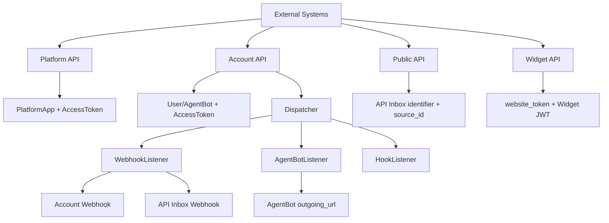

# Chatwoot API、Webhook 与扩展能力

本文基于 Chatwoot 当前代码实现与 OpenAPI/Swagger 定义进行分析，重点评估外部系统接入（尤其 AI Agent）的可行性与便利性。

## 1. API 体系总览
### 1.1 API 层次结构

Chatwoot 对外 API 可分为 4 层：

- Account API（/api/v1/accounts/...）
  - 面向单个 Account 的业务 API（会话、消息、联系人、收件箱、webhook、集成等）
  - 鉴权主体：User Access Token / AgentBot Access Token
- Platform API（/platform/api/v1/...）
  - 面向多账户编排与资源供应（Account/User/AgentBot/AccountUser 管理）
  - 鉴权主体：PlatformApp Access Token
- Public API（/public/api/v1/...）
  - 面向匿名访客/客户端场景（API Inbox 的 contacts/conversations/messages）
  - 不使用 api_access_token，依赖 inbox 标识 + source_id（可叠加 HMAC 身份校验）
- Widget API（/api/v1/widget/...）
  - 面向 Web Widget 客户端
  - 基于 website_token + X-Auth-Token（JWT）+ 可选 HMAC 身份校验

关系图：

目录扫描（控制器层）显示：

- Account API 控制器：`app/controllers/api/v1/accounts/` 下大量资源控制器，核心包括 conversations、conversations/messages、contacts、inboxes、agent_bots、webhooks、integrations 等。
- Platform API 控制器：`accounts_controller.rb`、`users_controller.rb`、`account_users_controller.rb`、`agent_bots_controller.rb`、`email_channel_migrations_controller.rb`。
- Public API 控制器：`inboxes_controller.rb` + `inboxes/contacts_controller.rb`、`inboxes/conversations_controller.rb`、`inboxes/messages_controller.rb`、`csat_survey_controller.rb`。
- Widget API 控制器：`base/configs/contacts/conversations/messages/events/inbox_members/labels/campaigns/direct_uploads` 等。

### 1.2 认证方式

Chatwoot 存在多种并行鉴权机制：

1. User Token（api_access_token）
- 通过 `AccessToken` 多态绑定到 `User`。
- 适用于 Account API 常规管理操作。
- 请求头：`api_access_token`（或 `HTTP_API_ACCESS_TOKEN`）。

2. AgentBot Token（api_access_token）
- 通过 `AccessToken` 绑定到 `AgentBot`。
- 可访问的 Account API 有明确白名单限制（`BOT_ACCESSIBLE_ENDPOINTS`）：
  - conversations: `toggle_status/toggle_typing_status/toggle_priority/create/update/custom_attributes`
  - conversations/messages: `create`
  - conversations/assignments: `create`
- 非白名单接口会被拒绝。

3. Platform App Token（api_access_token）
- `PlatformController` 会验证 token owner 必须是 `PlatformApp`。
- 且资源操作受 `PlatformAppPermissible` 范围约束（只允许操作被授权的 Account/User/AgentBot）。

4. Widget JWT（X-Auth-Token）
- 由 `Widget::TokenService` 签发，载荷含 `source_id`、`inbox_id`，默认 180 天过期（可由 `WIDGET_TOKEN_EXPIRY` 配置）。

5. HMAC 身份校验（Public/Widget）
- Public API 和 Widget 支持 `identifier_hash` 校验：
  - HMAC-SHA256(key: `channel.hmac_token`, data: identifier)
- `hmac_mandatory` 可强制开启身份校验。

6. Webhook 签名（出站）
- Account Webhook（`webhooks` 表）支持 secret，发送时附带：
  - `X-Chatwoot-Timestamp`
  - `X-Chatwoot-Signature: sha256=...`
  - `X-Chatwoot-Delivery`（delivery id）
- AgentBot webhook 与 API Inbox webhook 默认不带该签名。

### 1.3 API 基础约定

1. 基础 URL
- Swagger 默认 server: `https://app.chatwoot.com/`。
- 自托管通常为 `https://<your-domain>/api/...`。
- 主要路由前缀：
  - Platform: `/platform/api/v1`
  - Account: `/api/v1/accounts/{account_id}`
  - Public: `/public/api/v1`
  - Widget: `/api/v1/widget`

2. 分页
- 以 `page` 参数为主，分页策略因资源而异（非全局统一）。
- 示例：
  - Contacts: `RESULTS_PER_PAGE = 15`
  - Conversation attachments: `ATTACHMENT_RESULTS_PER_PAGE = 100`

3. 错误格式
- 常见错误返回：`{ error: "..." }`。
- 校验失败（RecordInvalid）可返回：`{ message, attributes }`。
- OpenAPI 中通用错误 schema 为 `bad_request_error`（含 `description/errors`）。

4. Rate Limiting
- 由 `rack-attack` 实现，且默认只在 production 启用。
- 全局 IP 限流默认 `3000 req/min`（`RACK_ATTACK_LIMIT`）。
- 关键 API 有专项限流：
  - `/api/v1/accounts/:id/contacts/search`
  - `/api/v1/accounts/:id/conversations/:id/transcript`
  - `/api/v2/accounts/:id/reports` 等
- Widget API 也有防刷限流（可通过环境变量关闭）。

## 2. 核心业务 API
### 2.1 Conversation API

核心能力（Account API）：

- 查询与检索：`index`、`meta`、`search`、`filter`
- 创建：`create`（支持与 contact/inbox/source_id 建链，可附带首条 message）
- 读取：`show`
- 状态管理：
  - `toggle_status`（open/resolved/pending/snoozed）
  - `mute/unmute`
  - `toggle_priority`
- 协作管理：
  - `assignments`（分配 agent / team / agent bot）
  - labels 管理
- 可见性与已读：`update_last_seen`、`unread`
- 其他：`custom_attributes`、`attachments`、`transcript`、`destroy`

实现特征：

- 会话主键对外使用 `display_id`，不是数据库 id。
- 对 AgentBot 有“pending -> open”的 bot handoff 特判。
- `assignments` 同时支持 `User` 与 `AgentBot`。

### 2.2 Message API

核心能力（Account API conversations/messages）：

- `index`：会话消息列表
- `create`：发送消息（含附件、模板参数、私有备注、echo/source_id 等）
- `update`：更新消息状态（sent/delivered/read/failed）
- `destroy`：软删除内容 + 清理附件
- `retry`：失败消息重试
- `translate`：调用 Google Translate 集成翻译

关键约束：

- “incoming message” 仅允许在 API Inbox 场景创建。
- `update`（状态更新）仅允许 API Inbox（`ensure_api_inbox`）。
- 支持 `private=true` 作为私有备注。

### 2.3 Contact API

核心能力：

- `index/search/filter/active/show`
- `create/update/destroy`
- `import/export`
- `contactable_inboxes`
- 联系人自定义属性维护

补充能力：

- Contact Merge API：`/api/v1/accounts/{account_id}/actions/contact_merge`
- 通过 `ContactMergeAction` 执行 base_contact 与 mergee_contact 合并。

### 2.4 Inbox API

核心能力：

- `index/show/create/update/destroy`
- 支持多渠道类型：`web_widget/api/email/line/telegram/whatsapp/sms`
- 支持设置 `agent_bot` 绑定（`set_agent_bot`）
- 支持 Working Hours / CSAT 配置 / Channel reauthorize

扩展点：

- API Inbox 可配置 `webhook_url`，用于消息事件回调。
- WhatsApp Cloud 提供 webhook 注册/健康检查相关能力。

### 2.5 Agent Bot API

核心能力：

- `index/show/create/update/destroy`
- `reset_access_token`
- 可设置 `outgoing_url`（Webhook Bot 模式）
- 可通过 inbox 级绑定参与会话自动化

实现事实：

- 当前 bot_type 以 `webhook` 为主（`AgentBot` 枚举）。

## 3. Platform API
### 3.1 适用场景

Platform API 主要用于“外部平台统一管理 Chatwoot 租户/用户/机器人”的场景：

- 批量创建与维护 Account
- 创建 User，并获取 SSO Login URL 或 Access Token
- 维护 Account 与 User 的角色关系（AccountUser）
- 创建/维护 AgentBot

### 3.2 认证方式

- 必须使用 PlatformApp 的 `api_access_token`。
- `PlatformController` 会校验 token owner 是 `PlatformApp`。
- 对具体资源的读写要通过 `PlatformAppPermissible` 授权检查。

### 3.3 主要操作（Account/User/AgentBot CRUD）

- Account：`create/show/update/delete`
- User：`create/show/update/delete` + `login`（SSO URL）+ `token`（user access token）
- AgentBot：`index/create/show/update/delete`
- AccountUser：`index/create/delete`（用户与账号的角色映射）

## 4. Webhook 系统
### 4.1 Webhook 配置

两条主线：

1. Account Webhook（可在 Account API 配置）
- 模型：`Webhook`（`webhook_type`: account_type/inbox_type）
- API：`/api/v1/accounts/{account_id}/webhooks`
- 支持事件订阅数组 `subscriptions`
- 每个 webhook 拥有 secret，可用于签名校验

2. API Inbox Webhook（Channel::Api）
- 在 API Inbox channel 上配置 `webhook_url`
- 无需单独 webhook 资源
- 由 `WebhookListener` 自动分发消息相关事件

### 4.2 事件类型完整列表

以 `Webhook::ALLOWED_WEBHOOK_EVENTS` 为准：

- `conversation_status_changed`
- `conversation_updated`
- `conversation_created`
- `contact_created`
- `contact_updated`
- `message_created`
- `message_updated`
- `webwidget_triggered`
- `inbox_created`
- `inbox_updated`
- `conversation_typing_on`
- `conversation_typing_off`

触发时机与 payload 概要：

- conversation_*：来源于 Conversation 事件分发；payload 包含 conversation/account/inbox 等结构，更新类事件附 `changed_attributes`。
- message_*：来源于 Message create/update；payload 包含 message、conversation、sender、attachments（若有）。
- contact_*：来源于 Contact create/update；payload 含 contact 数据，update 附 `changed_attributes`。
- webwidget_triggered：来自 widget 相关触发事件；payload 含 `contact_inbox` 与 `event_info`。
- inbox_*：来源于 Inbox create/update（需环境变量开启 inbox 事件）。
- typing_on/off：来源于 typing 状态切换；payload 含 user + conversation + is_private。

说明：Swagger 的 webhook 订阅枚举目前仍停留在较早版本（未完整覆盖 inbox_* 与 typing_*），代码能力强于文档。

### 4.3 AgentBot Webhook vs Account Webhook

1. 配置与目标
- AgentBot Webhook：`agent_bot.outgoing_url`
- Account Webhook：`webhooks.url` + `subscriptions`

2. 事件覆盖
- AgentBot Webhook：聚焦 bot 处理链（message_created/message_updated/conversation_opened/conversation_resolved/webwidget_triggered）。
- Account Webhook：面向账号级业务事件广播（上节 12 类）。

3. 安全与签名
- Account Webhook：支持 secret 签名头。
- AgentBot Webhook：默认无签名头（直接 POST payload）。

4. 失败处理
- AgentBot webhook 429/500 会重试；失败时可触发会话从 pending 回到 open（可配置保留 pending）。
- Account webhook：不强调重试机制，失败记录日志；对 message 事件在 API Inbox 场景可回写消息失败状态。

## 5. 集成体系
### 5.1 内置集成列表

`config/integration/apps.yml` 定义了可见集成应用，主要包括：

- webhook
- dashboard_apps
- openai
- linear
- notion
- slack
- dialogflow
- google_translate
- dyte
- shopify
- leadsquared（CRM）

其中不同集成可声明：

- `hook_type`（account/inbox）
- `feature_flag`
- `allow_multiple_hooks`
- `settings_json_schema`（配置校验）
- `settings_form_schema`（前端表单渲染）

### 5.2 集成实现模式

Chatwoot 集成有三层模式：

1. 配置层
- `Integrations::App` + `Integrations::Hook`
- Hook 保存 access_token/settings/reference_id/status

2. 事件驱动层
- Dispatcher -> `HookListener` -> `HookJob`
- 按 app_id 分发到 Slack/Dialogflow/GoogleTranslate/LeadSquared 等处理器

3. Provider 处理层
- 大量实现位于 `lib/integrations/**`
- 典型：
  - Slack：OAuth + channel 绑定 + send_on_slack
  - Dialogflow：message.created/updated 驱动对话机器人
  - Linear：Issue 创建/关联/检索
  - Shopify：按联系人拉取客户订单

### 5.3 Dashboard App

`DashboardApp` 提供“嵌入式工作台扩展”：

- 模型要求 `content` 为数组，元素结构至少包含：
  - `type`（目前枚举仅 `frame`）
  - `url`（必须 http/https）
- API 控制器支持 `index/show/create/update/destroy`。

这意味着可以在 Chatwoot 控制台内嵌外部页面，实现轻量扩展面板。

## 6. 扩展能力评估
### 6.1 外部 AI Agent 接入的 API 使用指南

推荐两种接入方案：

方案 A（推荐）：AgentBot Webhook 驱动

1. 创建 AgentBot（Account API 或 Platform API）
2. 设置 `outgoing_url` 指向你的 AI Agent 服务
3. 把 AgentBot 绑定到 Inbox（`set_agent_bot`）
4. 会话进入 pending 后，用户消息触发 webhook 到你的服务
5. 你的服务根据 payload 决策：
   - 自动回复：调用 Message API `create`
   - 转人工：调用 Assignment API 指派真人 + 可切状态
   - 结束会话：调用 Conversation `toggle_status` -> resolved

方案 B：Account Webhook + 普通 User Token

1. 创建 account webhook，订阅 `message_created` 等事件
2. 外部服务消费 webhook
3. 使用用户 token 调 Account API 回写消息/状态/分配

建议：

- 若你要“机器人身份”且权限最小化，用 AgentBot token。
- 若你要全量运维能力，用 User token（管理员或具备所需权限角色）。

### 6.2 API 能力矩阵

| 需求 | 对应 API | 是否可用 |
|------|---------|---------|
| 接收新消息通知 | Webhook（Account Webhook / AgentBot Webhook / API Inbox webhook） | 可用 |
| AI 自动回复 | Message API（`POST /conversations/{id}/messages`） | 可用 |
| 关闭会话 | Conversation API（`toggle_status` -> resolved） | 可用 |
| 转给人工客服 | Conversation Assignment API（`/assignments`） | 可用 |
| 获取会话历史 | Message API（`GET /conversations/{id}/messages`） | 可用 |
| 获取联系人信息 | Contact API（`GET /contacts/{id}`） | 可用 |

### 6.3 限制与注意事项

1. Bot Token 权限受白名单限制
- AgentBot 无法访问全部 Account API，仅能访问指定端点。

2. 消息状态更新有渠道约束
- Message `update` 仅允许 API Inbox 会话。

3. Platform API 不是“超级管理员绕过”
- 必须经过 `PlatformAppPermissible` 资源授权，未授权资源会 401。

4. Webhook 文档与代码存在轻微漂移
- Swagger webhook 枚举未完全覆盖代码中的全部可订阅事件（如 inbox_*、typing_*）。

5. Webhook 可靠性需调用方配合
- 超时默认 5 秒（可配），消费端应快速 ACK、异步处理、幂等去重。
- 可利用 `X-Chatwoot-Delivery` 做去重追踪。

6. Rate Limit 生产环境生效
- 需关注关键 API 的限流策略；高频 AI 轮询场景建议转为 webhook 驱动。

7. Public/Widget API 属于“会话客户端接口”
- 不适合作为后台管理 API 替代品。
- 对身份强校验场景应启用 HMAC 并妥善管理 token。

综合结论：

- Chatwoot 对“外部系统集成”已经具备成熟能力：
  - 管理面（Platform API）
  - 业务面（Account API）
  - 事件面（Webhook + Dispatcher）
  - 渠道客户端面（Public/Widget API）
  - UI 扩展面（Dashboard App）
- 对 AI Agent 场景尤其友好：可通过 AgentBot webhook + Message/Assignment/Conversation API 实现完整闭环，且具备较清晰的权限边界。