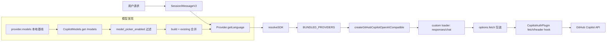

# Copilot Provider 系统集成详解

本文基于 opencode 当前代码实现，分析 GitHub Copilot provider 在 Provider 系统中的完整集成链路：注册、初始化、模型发现、模型实例化、请求参数/头变换、SSE 超时保护、错误分类与重试、cheap model 选择策略。

## 1. Provider 注册和初始化

### 1.1 ProviderID 定义

`ProviderID.githubCopilot` 在 `"github-copilot"` 上做了静态常量绑定：
- `packages/opencode/src/provider/schema.ts:20`

这意味着后续全链路（配置、鉴权、模型选择、hook 过滤）都以 `github-copilot` 作为 provider 主键。

### 1.2 BUNDLED_PROVIDERS 注册

Provider 核心把 npm 包名映射到 SDK 工厂函数，Copilot 的映射是：
- `"@ai-sdk/github-copilot" -> createGitHubCopilotOpenAICompatible`
- 代码位置：`packages/opencode/src/provider/provider.ts:127`、`packages/opencode/src/provider/provider.ts:148`

这一步让 Copilot 走「内置 provider」路径，不需要动态安装 npm 包。

### 1.3 `custom()["github-copilot"]` loader 的作用

`custom()` 返回 provider 级自定义加载器，其中 Copilot loader：
- `autoload: false`
- 覆盖 `getModel(sdk, modelID)` 选择逻辑
- 代码位置：`packages/opencode/src/provider/provider.ts:172`、`packages/opencode/src/provider/provider.ts:222-229`

具体决策：
1. 若 SDK 既无 `responses` 也无 `chat`（`useLanguageModel`），回退到 `sdk.languageModel(modelID)`（`packages/opencode/src/provider/provider.ts:168-170`, `225-226`）。
2. 否则调用 `shouldUseCopilotResponsesApi(modelID)`：
   - true -> `sdk.responses(modelID)`
   - false -> `sdk.chat(modelID)`
   - 位置：`packages/opencode/src/provider/provider.ts:227`

### 1.4 `shouldUseCopilotResponsesApi()` 判定

判定规则：
- 仅匹配 `gpt-(\d+)`
- 主版本 `>= 5` 且不是 `gpt-5-mini` 才走 Responses API
- 代码：`packages/opencode/src/provider/provider.ts:63-67`

含义：Copilot 下 GPT-5 主线模型默认走 responses；`gpt-5-mini` 保留 chat 路径。

### 1.5 Provider 初始化生命周期（端到端）

核心状态初始化在 `InstanceState.make` 中完成：
- 入口：`packages/opencode/src/provider/provider.ts:1017`

完整生命周期：
1. 读取配置与 models.dev 基础库：`config.get()` + `ModelsDev.get()`（`1020-1023`）。
2. 用 `fromModelsDevProvider` 转换成内部 `Info/Model` 结构（`1023`，实现见 `935-1014`）。
3. 读取插件列表（先于 cfg.provider，保证 plugin config hook 已生效）：`1082-1086`。
4. 合并用户配置 provider/model 覆盖（`1097-1179`）。
5. 从环境变量注入 API key（`1182+`），再加载 auth 存储（`1192+`）。
6. 执行 plugin auth loader，把 oauth/api 派生选项（如 baseURL/fetch）写回 provider options（`1211-1232`）。
7. 执行 `custom()` loader，注册 `modelLoaders/varsLoaders/discoveryLoaders` 并 merge options（`1234-1254`）。
8. 调用 plugin `provider.models` hook 动态改写模型表（Copilot 在这里做远程模型发现）：`1276-1308`。
9. 对模型做收尾：填充 `api.id`、过滤 deprecated/alpha/黑白名单、计算 `variants`（`1310-1352`）。

### 1.6 SDK 实例创建与复用

当真正请求模型时，`getLanguage(model)` 会：
- 先 `resolveSDK(model, state)` 拿到 provider SDK
- 再优先调用 provider 专属 `modelLoader`（Copilot 就是 custom loader），否则 `sdk.languageModel`
- 位置：`packages/opencode/src/provider/provider.ts:1498-1533`

`resolveSDK()` 流程要点：
1. 拼装 provider options（含 baseURL 模板变量展开、apiKey、model.headers 注入）`1384-1408`。
2. 计算哈希 key 缓存 SDK（同配置复用）`1409-1418`。
3. 包装 `options.fetch`（组合 signal、timeout、chunkTimeout）`1420-1454`。
4. 通过 `BUNDLED_PROVIDERS[model.api.npm]` 创建内置 SDK（Copilot 在此命中）`1456-1467`。

## 2. 模型发现机制

### 2.1 `CopilotModels.get()` 请求流程

实现位置：`packages/opencode/src/plugin/github-copilot/models.ts`。

流程：
1. 请求 `${baseURL}/models`，超时 5 秒：`99-103`。
2. 非 2xx 抛错：`104-106`。
3. 用 `CopilotModels.schema` 校验响应：`107`。
4. 仅保留 `model_picker_enabled === true` 的模型：`124`。
5. 将远程模型合并进 `existing`：
   - existing 中 `api.id` 不在远程列表则删掉：`127-132`
   - existing 中保留项用远程字段刷新：`133`
   - 远程新增项补入：`136-140`

### 2.2 `CopilotModels.schema` 结构

关键字段：
- 顶层：`{ data: Item[] }`（`5-39`）
- `Item`：
  - `model_picker_enabled`、`id`、`name`、`version`、`supported_endpoints?`（`8-13`）
  - `capabilities.family`（`15`）
  - `capabilities.limits`：`max_context_window_tokens`、`max_output_tokens`、`max_prompt_tokens`、`vision?`（`16-24`）
  - `capabilities.supports`：`adaptive_thinking?`、`reasoning_effort?`、`tool_calls`、`vision?`、`streaming` 等（`26-34`）

### 2.3 `build()`：远程数据到内部 Model

`build(key, remote, url, prev?)` 转换规则（`45-96`）：
- `providerID` 固定 `github-copilot`（`55`）
- `api.npm` 固定 `@ai-sdk/github-copilot`（`59`）
- `api.id = remote.id`，`api.url = baseURL`（`57-59`）
- `status` 强制 `active`（`62`）
- `limit` 来自远程 limits（`63-67`）
- 能力推断：
  - `reasoning`: adaptive_thinking / reasoning_effort / thinking budget 任一存在（`46-50`）
  - `image`: supports.vision 或 vision media type 包含 `image/*`（`51-53`）
  - `toolcall`: `supports.tool_calls`（`73`）
- 成本固定免费：`cost.input=0`、`cost.output=0`、`cache=0`（`85-89`）
- 字段优先级：`prev`（既有本地元数据）优先于远程（如 `family/name/options/headers/release_date/variants`，见 `84-95`）

### 2.4 与 models.dev 的合并

`provider` hook 调用：`CopilotModels.get(baseURL, headers, provider.models)`，把当前 provider 模型表作为 `existing` 传入（`packages/opencode/src/plugin/github-copilot/copilot.ts:50-55`）。

因此合并语义是：
- 本地 models.dev/配置先给默认信息
- 远程 `/models` 提供实时可用集与限额
- 再按 `build()` 的「远程优先 + 部分本地保留」策略合并

### 2.5 `provider` hook 的两条路径

在 `CopilotAuthPlugin` 中：
- 有 OAuth：拉远程模型列表（`copilot.ts:49-55`）
- 无 OAuth：直接返回本地 provider.models，但先 `fix()` 把 `api.npm` 统一成 `@ai-sdk/github-copilot`（`44-48`、`30-37`）

并且远程拉取失败会降级到 `fix(provider.models)`（`56-60`）。

## 3. 请求参数变换

### 3.1 `chat.params`：GPT 模型清空 `maxOutputTokens`

逻辑：
- 仅对 `providerID` 含 `github-copilot` 生效
- 若 `incoming.model.api.id` 含 `gpt`，则 `output.maxOutputTokens = undefined`
- 位置：`packages/opencode/src/plugin/github-copilot/copilot.ts:312-318`

原因（代码注释）：对齐 `github copilot cli` 行为，避免在 GPT 路径上强制该字段导致兼容性问题。

### 3.2 `chat.headers`：动态头注入

逻辑位置：`packages/opencode/src/plugin/github-copilot/copilot.ts:320-358`。

三类处理：
1. Anthropic 模型注入 beta 头：
   - 条件：`incoming.model.api.npm === "@ai-sdk/anthropic"`
   - 头：`anthropic-beta: interleaved-thinking-2025-05-14`
   - 位置：`322-326`
2. compaction 消息检测：
   - 查询当前 message parts，存在 `part.type === "compaction"` 则 `x-initiator=agent`
   - 位置：`328-346`
3. 子 agent session 标记：
   - 若 session 有 `parentID`，同样 `x-initiator=agent`
   - 位置：`348-358`

补充：auth loader 自定义 fetch 也会按请求体自动设置 `x-initiator`（agent/user），并注入 `Authorization`、`Openai-Intent`、`User-Agent`、`Copilot-Vision-Request`（vision 时）等头（`copilot.ts:72-141`）。

### 3.3 `ProviderTransform` 中与 Copilot 相关的变换

`packages/opencode/src/provider/transform.ts` 里的 Copilot 相关点：
- providerOptions key 映射：`@ai-sdk/github-copilot -> copilot`（`26-27`）
- 缓存标记字段：`copilot.copilot_cache_control = { type: "ephemeral" }`（`209-211`）
- reasoning variants（Copilot 分支）：
  - gemini 返回空（注释：Copilot 仅返回 thinking）
  - claude 支持 low/medium/high
  - gpt-5 系列按版本与发布日期决定是否开放 `xhigh`
  - 位置：`463-487`
- 默认 options：Copilot 走 openai 家族默认 `store=false`（`756`）
- `smallOptions`：Copilot 与 OpenAI 同策略（GPT-5 给 low/minimal，其他只 `store=false`）`865-882`

## 4. Model 数据结构

内部 `Model` 类型定义在：`packages/opencode/src/provider/provider.ts:821-889`。

字段说明：
- `id`/`providerID`：内部主键
- `api`: `{ id, url, npm }`
- `name`/`family`
- `capabilities`: 温度、推理、附件、工具调用、输入输出模态、interleaved
- `cost`: input/output/cache（含 `experimentalOver200K` 可选）
- `limit`: context/input/output
- `status`: `alpha|beta|deprecated|active`
- `options`/`headers`: provider/model 级透传参数
- `release_date`
- `variants`: 推理档位等预设

Copilot 模型的典型特征（由 `CopilotModels.build` 生成）：
- `api.npm: "@ai-sdk/github-copilot"`：声明底层 SDK 工厂，驱动 Provider 的 bundled 路由（`models.ts:59` + `provider.ts:1456`）
- `api.url` vs `api.id`：
  - `api.url` 是 provider 基地址（如 `https://api.githubcopilot.com`）
  - `api.id` 是请求时传给 SDK 的模型标识（如 `gpt-5` 变体）
  - 见 `models.ts:57-59`
- `cost` 全 0：Copilot 在内部统一按免费处理（`models.ts:85-89`）
- `status: "active"`：远端结果总是强制 active（`models.ts:62`）
- `variants`/`options` 用途：
  - `variants` 提供推理档位预设（由 `ProviderTransform.variants` 生成/合并，`provider.ts:1341-1348`）
  - `options` 为模型级额外参数，可与 provider.options 合并后传入 loader（`provider.ts:1515-1518`）

## 5. SSE 超时保护

`wrapSSE(res, ms, ctl)` 在 SSE 响应上包一层带读超时的 `ReadableStream`：
- 仅当 `ms>0`、有 `res.body`、且 `content-type` 包含 `text/event-stream` 才启用（`provider.ts:69-73`）
- 每次 `reader.read()` 都套 `setTimeout(ms)`；超时即：
  - `ctl.abort(err)`
  - `reader.cancel(err)`
  - 抛错 `SSE read timed out`
  - 见 `provider.ts:77-94`
- 正常读到分片则清理计时器并 `enqueue`（`95-104`）

为什么需要：避免上游 SSE 连接“不断开也不出新 chunk”导致请求永久挂起。

超时值来源：
- `resolveSDK()` 从 provider options 读取 `chunkTimeout`（`provider.ts:1421-1423`）
- 在自定义 fetch 完成后调用 `wrapSSE(res, chunkTimeout, chunkAbortCtl)`（`1452-1454`）

## 6. 错误处理

### 6.1 Copilot overflow pattern

`ProviderError.OVERFLOW_PATTERNS` 明确包含 Copilot 文案：
- `/exceeds the limit of \d+/i`
- 位置：`packages/opencode/src/provider/error.ts:17`

### 6.2 分类：`context_overflow` vs `api_error`

`parseAPICallError` 逻辑（`error.ts:173-192`）：
- 若命中 overflow 正则，或状态码 413，或 body code=`context_length_exceeded` => `context_overflow`（`176-181`）
- 否则归类 `api_error`，并保留 status/headers/body/metadata（`185-191`）

`parseStreamError` 也会把流式错误 code 映射到同类结构（`119-153`）。

### 6.3 重试逻辑

`parseAPICallError` 输出 `isRetryable`：
- openai 系 provider 特判：404 也视为可重试（`31-35`、`189-190`）
- 其他 provider 使用 SDK 原始 `error.isRetryable`（`191`）

上层在消息流程中消费这个标志并落为 `MessageV2.APIError.isRetryable`（`packages/opencode/src/session/message-v2.ts:999-1018`），随后 `SessionRetry.retryable()` 依据它决定是否进入重试策略（`packages/opencode/src/session/retry.ts:57-61`）。

## 7. cheap model 选择

`getSmallModel()` 的通用优先级初始列表：
- `claude-haiku-4-5`
- `claude-haiku-4.5`
- `3-5-haiku`
- `3.5-haiku`
- `gemini-3-flash`
- `gemini-2.5-flash`
- `gpt-5-nano`
- 代码：`packages/opencode/src/provider/provider.ts:1587-1594`

Copilot provider 会前置更偏好的 cheap 模型：
- `gpt-5-mini`
- `claude-haiku-4.5`
- 然后再接通用列表
- 代码：`packages/opencode/src/provider/provider.ts:1595-1597`

对比：
- `opencode*` provider 会把列表收敛到仅 `gpt-5-nano`（`1592-1594`）
- `amazon-bedrock` 还带跨区域前缀优先策略（`1599-1617`）

## 数据流图

## 小结

Copilot 在 opencode 中不是“旁路插件”，而是完整接入 Provider 主干：
- 在 Provider 层以 `@ai-sdk/github-copilot` 作为 bundled provider 注册；
- 在 plugin 层补齐 OAuth、远程模型发现、请求头策略；
- 在 transform 层统一推理档位、缓存标记与默认参数；
- 在 error/retry 层沿用统一语义（context overflow 与 retryable API error）。

这使得 Copilot 与其他 provider 共享同一套生命周期与治理能力，同时保留 Copilot 专属的 API 选择、模型发现和 header 协议差异。